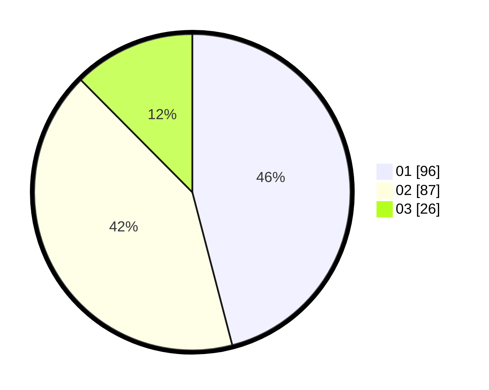

# Hasil

Hasil perolehan suara paslon dapat dilihat pada file paslon-01.txt, paslon-02.txt, dan paslon-03.txt.

Jika tidak ada, artinya data tersebut belum ada pada SIREKAP.

## Perolehan Suara

 * Paslon 01: **96**.
 * Paslon 02: **87**.
 * Paslon 03: **26**.

## Foto C Plano

https://sirekap-obj-formc.kpu.go.id/9377/pemilu/ppwp/31/71/02/10/02/3171021002050-20240216-135744--f0385d23-421c-45af-8a93-68e52e828ef2.jpg

https://sirekap-obj-formc.kpu.go.id/9377/pemilu/ppwp/31/71/02/10/02/3171021002050-20240216-135746--6a0fc4c3-85ab-4573-a802-12e15c556ab1.jpg

https://sirekap-obj-formc.kpu.go.id/9377/pemilu/ppwp/31/71/02/10/02/3171021002050-20240216-135745--02b855ae-c5b0-40c0-8ff0-7ea2969cece1.jpg

## DATA PEMILIH TETAP

Jumlah pemilih dalam DPT: **260**.
 * L: **138**.
 * P: **122**.

## DATA PENGGUNA HAK PILIH

Jumlah pengguna hak pilih dalam DPT: **202**.
 * L: **104**.
 * P: **98**.

Jumlah pengguna hak pilih dalam DPTb: **5**.
 * L: **3**.
 * P: **2**.

Jumlah pengguna hak pilih dalam DPK: **2**.
 * L: **2**.
 * P: **0**.

Jumlah pengguna hak pilih: **209**.
 * L: **109**.
 * P: **100**.

## JUMLAH SUARA SAH DAN TIDAK SAH

JUMLAH SELURUH SUARA SAH: **209**.

JUMLAH SUARA TIDAK SAH: **0**.

JUMLAH SELURUH SUARA SAH DAN SUARA TIDAK SAH: **209**.
