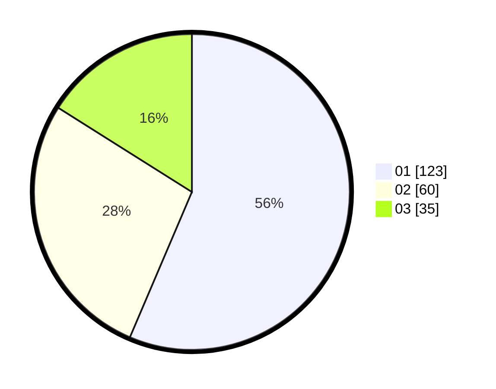

# Hasil

Hasil perolehan suara paslon dapat dilihat pada file paslon-01.txt, paslon-02.txt, dan paslon-03.txt.

Jika tidak ada, artinya data tersebut belum ada pada SIREKAP.

## Perolehan Suara

 * Paslon 01: **123**.
 * Paslon 02: **60**.
 * Paslon 03: **35**.

## Foto C Plano

https://sirekap-obj-formc.kpu.go.id/a478/pemilu/ppwp/31/71/02/10/02/3171021002055-20240216-044836--54b0780f-2888-4e27-8baa-601a9375cb80.jpg

https://sirekap-obj-formc.kpu.go.id/a478/pemilu/ppwp/31/71/02/10/02/3171021002055-20240216-044847--4ba02dfa-4010-4e2c-a320-a43d840595de.jpg

https://sirekap-obj-formc.kpu.go.id/a478/pemilu/ppwp/31/71/02/10/02/3171021002055-20240216-044840--a719b2bd-b2c5-4f9a-8cbd-f41df5bb3dc2.jpg

## DATA PEMILIH TETAP

Jumlah pemilih dalam DPT: **280**.
 * L: **148**.
 * P: **132**.

## DATA PENGGUNA HAK PILIH

Jumlah pengguna hak pilih dalam DPT: **216**.
 * L: **102**.
 * P: **114**.

Jumlah pengguna hak pilih dalam DPTb: **5**.
 * L: **2**.
 * P: **3**.

Jumlah pengguna hak pilih dalam DPK: **0**.
 * L: **0**.
 * P: **0**.

Jumlah pengguna hak pilih: **221**.
 * L: **104**.
 * P: **117**.

## JUMLAH SUARA SAH DAN TIDAK SAH

JUMLAH SELURUH SUARA SAH: **218**.

JUMLAH SUARA TIDAK SAH: **3**.

JUMLAH SELURUH SUARA SAH DAN SUARA TIDAK SAH: **221**.
