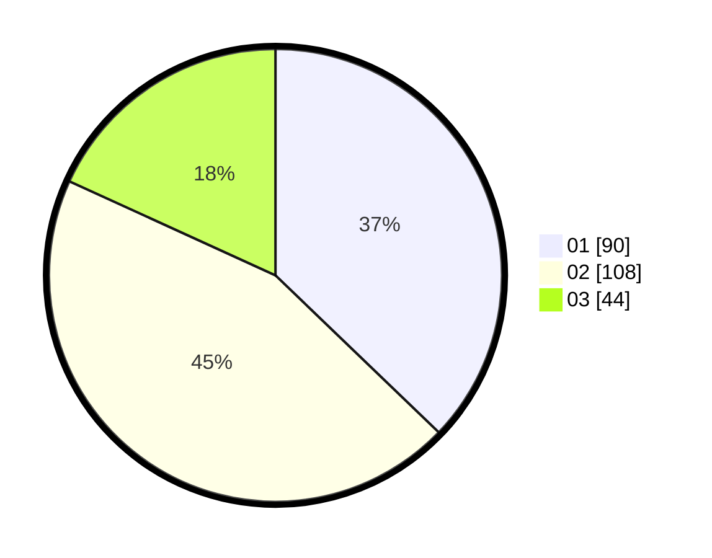

# Hasil

Hasil perolehan suara paslon dapat dilihat pada file paslon-01.txt, paslon-02.txt, dan paslon-03.txt.

Jika tidak ada, artinya data tersebut belum ada pada SIREKAP.

## Perolehan Suara

 * Paslon 01: **90**.
 * Paslon 02: **108**.
 * Paslon 03: **44**.

## Foto C Plano

https://sirekap-obj-formc.kpu.go.id/a98c/pemilu/ppwp/31/71/02/10/02/3171021002056-20240215-235027--c57fcd80-6b39-48b8-86a3-73da78b3c6ac.jpg

https://sirekap-obj-formc.kpu.go.id/a98c/pemilu/ppwp/31/71/02/10/02/3171021002056-20240215-235029--8659f5ed-348b-43ee-a97b-0e4d106c9aa5.jpg

https://sirekap-obj-formc.kpu.go.id/a98c/pemilu/ppwp/31/71/02/10/02/3171021002056-20240215-235028--a28b5a97-42c4-4469-9a02-098b8f1d44b2.jpg

## DATA PEMILIH TETAP

Jumlah pemilih dalam DPT: **281**.
 * L: **137**.
 * P: **144**.

## DATA PENGGUNA HAK PILIH

Jumlah pengguna hak pilih dalam DPT: **240**.
 * L: **117**.
 * P: **123**.

Jumlah pengguna hak pilih dalam DPTb: **4**.
 * L: **2**.
 * P: **2**.

Jumlah pengguna hak pilih dalam DPK: **0**.
 * L: **0**.
 * P: **0**.

Jumlah pengguna hak pilih: **244**.
 * L: **119**.
 * P: **125**.

## JUMLAH SUARA SAH DAN TIDAK SAH

JUMLAH SELURUH SUARA SAH: **242**.

JUMLAH SUARA TIDAK SAH: **2**.

JUMLAH SELURUH SUARA SAH DAN SUARA TIDAK SAH: **244**.
