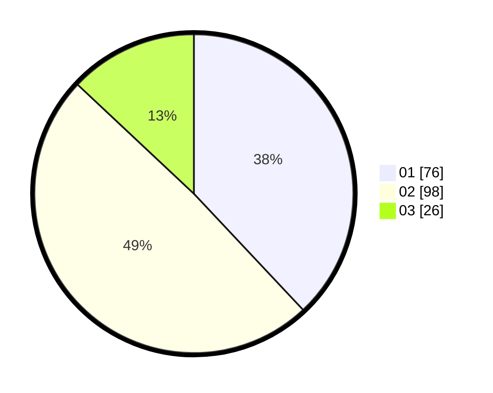

# Hasil

Hasil perolehan suara paslon dapat dilihat pada file paslon-01.txt, paslon-02.txt, dan paslon-03.txt.

Jika tidak ada, artinya data tersebut belum ada pada SIREKAP.

## Perolehan Suara

 * Paslon 01: **76**.
 * Paslon 02: **98**.
 * Paslon 03: **26**.

## Foto C Plano

https://sirekap-obj-formc.kpu.go.id/19fc/pemilu/ppwp/31/71/02/10/02/3171021002057-20240216-103336--8b41cc6b-bb87-4077-81a8-05ff4441f5a2.jpg

https://sirekap-obj-formc.kpu.go.id/19fc/pemilu/ppwp/31/71/02/10/02/3171021002057-20240216-080546--39445b8a-fa79-48fe-813b-7149d73d3bd7.jpg

https://sirekap-obj-formc.kpu.go.id/19fc/pemilu/ppwp/31/71/02/10/02/3171021002057-20240216-103337--69664452-7f7c-4b06-8ed9-a86600d0dfd7.jpg

## DATA PEMILIH TETAP

Jumlah pemilih dalam DPT: **284**.
 * L: **137**.
 * P: **147**.

## DATA PENGGUNA HAK PILIH

Jumlah pengguna hak pilih dalam DPT: **197**.
 * L: **87**.
 * P: **110**.

Jumlah pengguna hak pilih dalam DPTb: **4**.
 * L: **2**.
 * P: **2**.

Jumlah pengguna hak pilih dalam DPK: **1**.
 * L: **1**.
 * P: **0**.

Jumlah pengguna hak pilih: **202**.
 * L: **90**.
 * P: **112**.

## JUMLAH SUARA SAH DAN TIDAK SAH

JUMLAH SELURUH SUARA SAH: **200**.

JUMLAH SUARA TIDAK SAH: **2**.

JUMLAH SELURUH SUARA SAH DAN SUARA TIDAK SAH: **202**.
