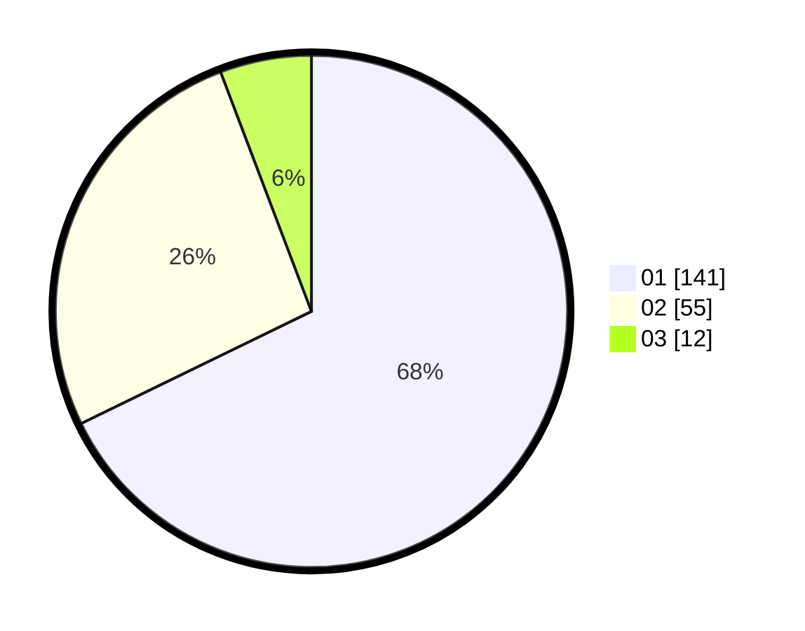

# Hasil

Hasil perolehan suara paslon dapat dilihat pada file paslon-01.txt, paslon-02.txt, dan paslon-03.txt.

Jika tidak ada, artinya data tersebut belum ada pada SIREKAP.

## Perolehan Suara

 * Paslon 01: **141**.
 * Paslon 02: **55**.
 * Paslon 03: **12**.

## Foto C Plano

https://sirekap-obj-formc.kpu.go.id/87c0/pemilu/ppwp/31/71/02/10/02/3171021002060-20240216-190423--f4b99d36-379f-4a0f-9f69-fcf97481b370.jpg

https://sirekap-obj-formc.kpu.go.id/87c0/pemilu/ppwp/31/71/02/10/02/3171021002060-20240216-190425--7f087002-6eff-442d-9dfe-8445f29e1c3b.jpg

https://sirekap-obj-formc.kpu.go.id/87c0/pemilu/ppwp/31/71/02/10/02/3171021002060-20240216-190424--b8f970d7-bdff-4afc-9605-8db6067ddd2e.jpg

## DATA PEMILIH TETAP

Jumlah pemilih dalam DPT: **266**.
 * L: **136**.
 * P: **130**.

## DATA PENGGUNA HAK PILIH

Jumlah pengguna hak pilih dalam DPT: **208**.
 * L: **105**.
 * P: **103**.

Jumlah pengguna hak pilih dalam DPTb: **0**.
 * L: **0**.
 * P: **0**.

Jumlah pengguna hak pilih dalam DPK: **1**.
 * L: **1**.
 * P: **0**.

Jumlah pengguna hak pilih: **209**.
 * L: **106**.
 * P: **103**.

## JUMLAH SUARA SAH DAN TIDAK SAH

JUMLAH SELURUH SUARA SAH: **208**.

JUMLAH SUARA TIDAK SAH: **1**.

JUMLAH SELURUH SUARA SAH DAN SUARA TIDAK SAH: **209**.
