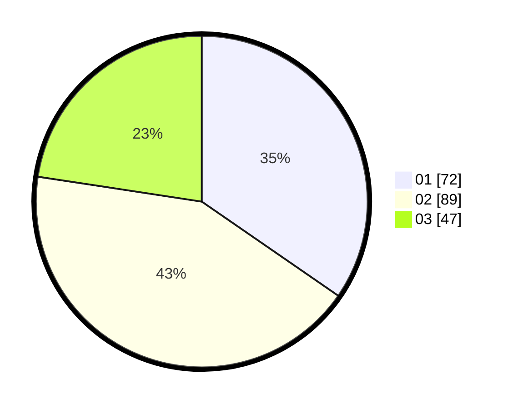

# Hasil

Hasil perolehan suara paslon dapat dilihat pada file paslon-01.txt, paslon-02.txt, dan paslon-03.txt.

Jika tidak ada, artinya data tersebut belum ada pada SIREKAP.

## Perolehan Suara

 * Paslon 01: **72**.
 * Paslon 02: **89**.
 * Paslon 03: **47**.

## Foto C Plano

https://sirekap-obj-formc.kpu.go.id/21b7/pemilu/ppwp/31/71/02/10/02/3171021002066-20240216-001615--76f5b608-529b-45ab-b831-43157f1f6142.jpg

https://sirekap-obj-formc.kpu.go.id/21b7/pemilu/ppwp/31/71/02/10/02/3171021002066-20240216-001619--00ec26f2-f5a7-4b3b-a8df-e5185c43eafb.jpg

https://sirekap-obj-formc.kpu.go.id/21b7/pemilu/ppwp/31/71/02/10/02/3171021002066-20240216-001616--85fd96c4-0275-44f4-9468-eff2487f5274.jpg

## DATA PEMILIH TETAP

Jumlah pemilih dalam DPT: **205**.
 * L: **97**.
 * P: **108**.

## DATA PENGGUNA HAK PILIH

Jumlah pengguna hak pilih dalam DPT: **205**.
 * L: **97**.
 * P: **108**.

Jumlah pengguna hak pilih dalam DPTb: **205**.
 * L: **97**.
 * P: **108**.

Jumlah pengguna hak pilih dalam DPK: **7**.
 * L: **4**.
 * P: **3**.

Jumlah pengguna hak pilih: **214**.
 * L: **102**.
 * P: **112**.

## JUMLAH SUARA SAH DAN TIDAK SAH

JUMLAH SELURUH SUARA SAH: **208**.

JUMLAH SUARA TIDAK SAH: **6**.

JUMLAH SELURUH SUARA SAH DAN SUARA TIDAK SAH: **214**.
