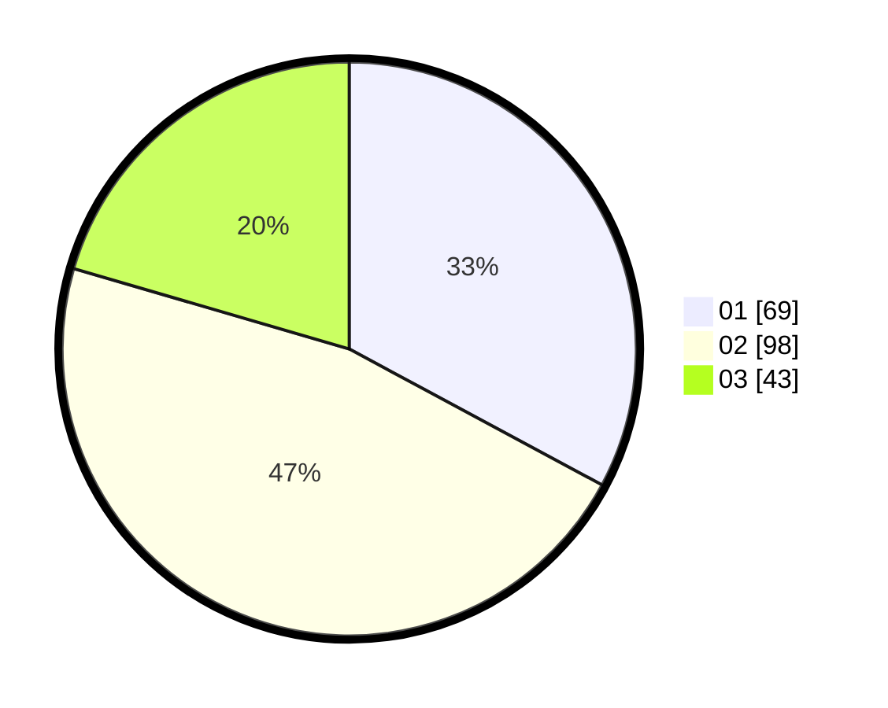

# Hasil

Hasil perolehan suara paslon dapat dilihat pada file paslon-01.txt, paslon-02.txt, dan paslon-03.txt.

Jika tidak ada, artinya data tersebut belum ada pada SIREKAP.

## Perolehan Suara

 * Paslon 01: **69**.
 * Paslon 02: **98**.
 * Paslon 03: **43**.

## Foto C Plano

https://sirekap-obj-formc.kpu.go.id/25fa/pemilu/ppwp/31/71/02/10/02/3171021002067-20240216-092816--78d48b1c-331b-4cf7-8891-849886c57d36.jpg

https://sirekap-obj-formc.kpu.go.id/25fa/pemilu/ppwp/31/71/02/10/02/3171021002067-20240216-092820--a359844f-816c-4f60-9c31-6b48facda01f.jpg

https://sirekap-obj-formc.kpu.go.id/25fa/pemilu/ppwp/31/71/02/10/02/3171021002067-20240216-092818--7b261f84-3d48-483e-85f1-8428b7b960f1.jpg

## DATA PEMILIH TETAP

Jumlah pemilih dalam DPT: **286**.
 * L: **141**.
 * P: **145**.

## DATA PENGGUNA HAK PILIH

Jumlah pengguna hak pilih dalam DPT: **205**.
 * L: **104**.
 * P: **101**.

Jumlah pengguna hak pilih dalam DPTb: **6**.
 * L: **2**.
 * P: **4**.

Jumlah pengguna hak pilih dalam DPK: **0**.
 * L: **0**.
 * P: **0**.

Jumlah pengguna hak pilih: **211**.
 * L: **106**.
 * P: **105**.

## JUMLAH SUARA SAH DAN TIDAK SAH

JUMLAH SELURUH SUARA SAH: **210**.

JUMLAH SUARA TIDAK SAH: **1**.

JUMLAH SELURUH SUARA SAH DAN SUARA TIDAK SAH: **211**.
