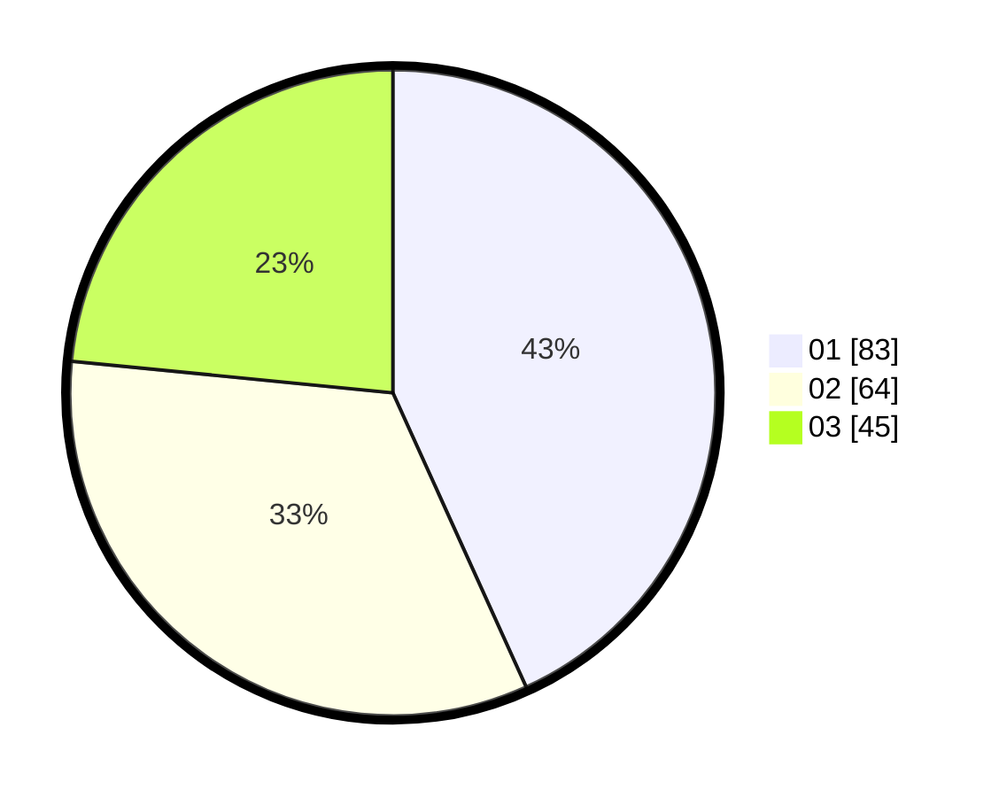

# Hasil

Hasil perolehan suara paslon dapat dilihat pada file paslon-01.txt, paslon-02.txt, dan paslon-03.txt.

Jika tidak ada, artinya data tersebut belum ada pada SIREKAP.

## Perolehan Suara

 * Paslon 01: **83**.
 * Paslon 02: **64**.
 * Paslon 03: **45**.

## Foto C Plano

https://sirekap-obj-formc.kpu.go.id/6ff6/pemilu/ppwp/31/71/02/10/02/3171021002068-20240216-150443--6ce9cefd-1c77-4a52-ae28-9051b80f0e2c.jpg

https://sirekap-obj-formc.kpu.go.id/6ff6/pemilu/ppwp/31/71/02/10/02/3171021002068-20240216-150444--2617e25f-9601-4144-a2be-b612759b2496.jpg

https://sirekap-obj-formc.kpu.go.id/6ff6/pemilu/ppwp/31/71/02/10/02/3171021002068-20240216-150443--5cc51a1a-336a-4e98-8b4a-1e3f0265c811.jpg

## DATA PEMILIH TETAP

Jumlah pemilih dalam DPT: **265**.
 * L: **134**.
 * P: **131**.

## DATA PENGGUNA HAK PILIH

Jumlah pengguna hak pilih dalam DPT: **187**.
 * L: **95**.
 * P: **92**.

Jumlah pengguna hak pilih dalam DPTb: **6**.
 * L: **4**.
 * P: **2**.

Jumlah pengguna hak pilih dalam DPK: **1**.
 * L: **1**.
 * P: **0**.

Jumlah pengguna hak pilih: **194**.
 * L: **100**.
 * P: **94**.

## JUMLAH SUARA SAH DAN TIDAK SAH

JUMLAH SELURUH SUARA SAH: **192**.

JUMLAH SUARA TIDAK SAH: **2**.

JUMLAH SELURUH SUARA SAH DAN SUARA TIDAK SAH: **194**.
