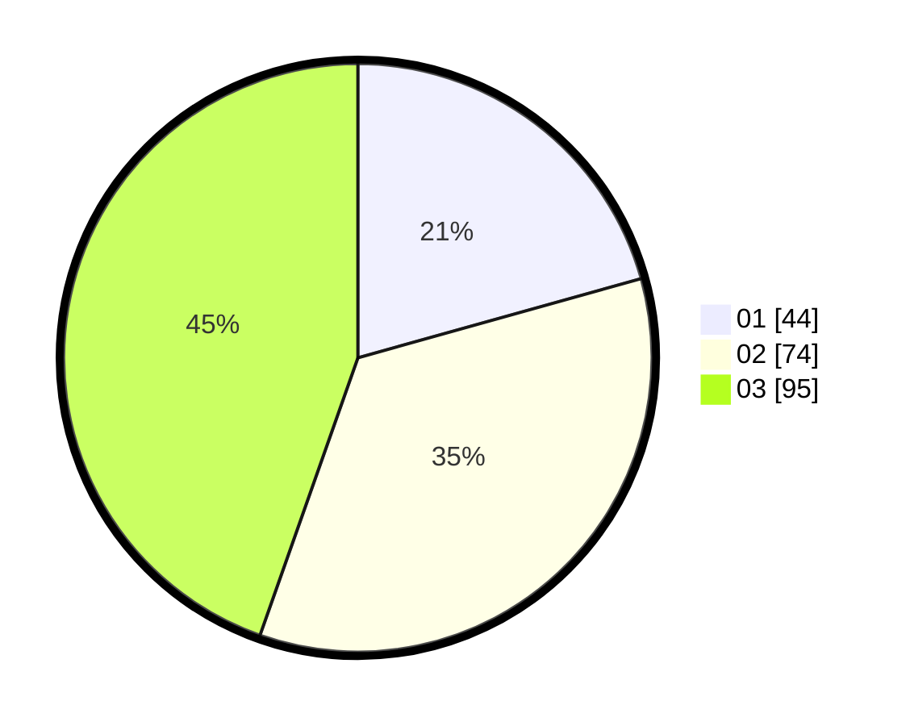

# Hasil

Hasil perolehan suara paslon dapat dilihat pada file paslon-01.txt, paslon-02.txt, dan paslon-03.txt.

Jika tidak ada, artinya data tersebut belum ada pada SIREKAP.

## Perolehan Suara

 * Paslon 01: **44**.
 * Paslon 02: **74**.
 * Paslon 03: **95**.

## Foto C Plano

https://sirekap-obj-formc.kpu.go.id/e322/pemilu/ppwp/31/71/02/10/02/3171021002073-20240216-001641--980ad3db-231d-4a1c-b8ab-c35309aa95ff.jpg

https://sirekap-obj-formc.kpu.go.id/e322/pemilu/ppwp/31/71/02/10/02/3171021002073-20240216-001644--b719aa87-0572-4392-8efe-132cd32924e2.jpg

https://sirekap-obj-formc.kpu.go.id/e322/pemilu/ppwp/31/71/02/10/02/3171021002073-20240216-001643--8783eb38-e8a4-48e9-b401-32a6669d8486.jpg

## DATA PEMILIH TETAP

Jumlah pemilih dalam DPT: **273**.
 * L: **128**.
 * P: **145**.

## DATA PENGGUNA HAK PILIH

Jumlah pengguna hak pilih dalam DPT: **211**.
 * L: **103**.
 * P: **108**.

Jumlah pengguna hak pilih dalam DPTb: **0**.
 * L: **0**.
 * P: **0**.

Jumlah pengguna hak pilih dalam DPK: **2**.
 * L: **0**.
 * P: **2**.

Jumlah pengguna hak pilih: **213**.
 * L: **103**.
 * P: **110**.

## JUMLAH SUARA SAH DAN TIDAK SAH

JUMLAH SELURUH SUARA SAH: **213**.

JUMLAH SUARA TIDAK SAH: **0**.

JUMLAH SELURUH SUARA SAH DAN SUARA TIDAK SAH: **213**.
