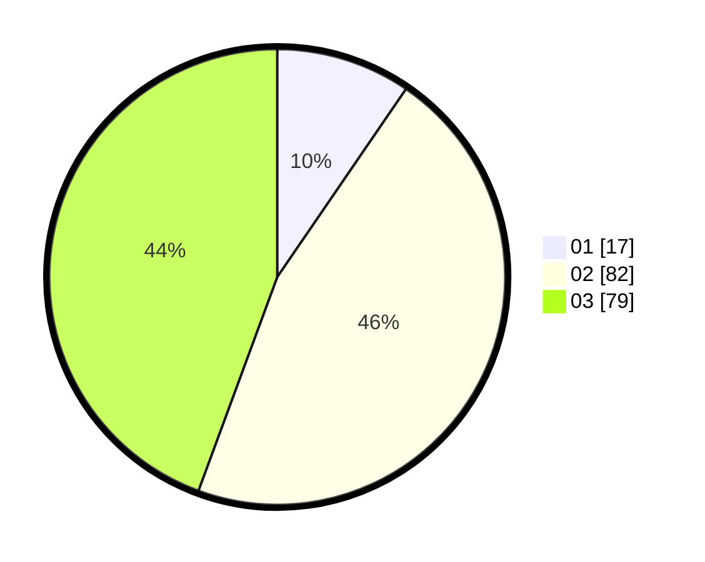

# Hasil

Hasil perolehan suara paslon dapat dilihat pada file paslon-01.txt, paslon-02.txt, dan paslon-03.txt.

Jika tidak ada, artinya data tersebut belum ada pada SIREKAP.

## Perolehan Suara

 * Paslon 01: **17**.
 * Paslon 02: **82**.
 * Paslon 03: **79**.

## Foto C Plano

https://sirekap-obj-formc.kpu.go.id/8e66/pemilu/ppwp/31/71/02/10/02/3171021002074-20240216-212631--324f3175-3435-488e-9ee2-16150eedb071.jpg

https://sirekap-obj-formc.kpu.go.id/8e66/pemilu/ppwp/31/71/02/10/02/3171021002074-20240216-212632--a6d56d2d-f5e7-4517-a01e-38ef339104fb.jpg

https://sirekap-obj-formc.kpu.go.id/8e66/pemilu/ppwp/31/71/02/10/02/3171021002074-20240216-212632--464c43d7-edde-49e2-9a8a-14f8c5f55cf4.jpg

## DATA PEMILIH TETAP

Jumlah pemilih dalam DPT: **272**.
 * L: **133**.
 * P: **139**.

## DATA PENGGUNA HAK PILIH

Jumlah pengguna hak pilih dalam DPT: **174**.
 * L: **85**.
 * P: **89**.

Jumlah pengguna hak pilih dalam DPTb: **6**.
 * L: **2**.
 * P: **4**.

Jumlah pengguna hak pilih dalam DPK: **0**.
 * L: **0**.
 * P: **0**.

Jumlah pengguna hak pilih: **180**.
 * L: **87**.
 * P: **93**.

## JUMLAH SUARA SAH DAN TIDAK SAH

JUMLAH SELURUH SUARA SAH: **178**.

JUMLAH SUARA TIDAK SAH: **2**.

JUMLAH SELURUH SUARA SAH DAN SUARA TIDAK SAH: **180**.
