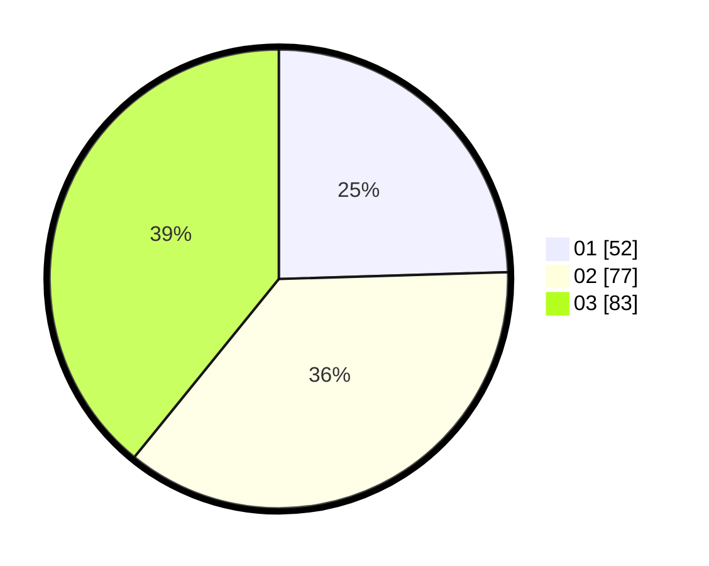

# Hasil

Hasil perolehan suara paslon dapat dilihat pada file paslon-01.txt, paslon-02.txt, dan paslon-03.txt.

Jika tidak ada, artinya data tersebut belum ada pada SIREKAP.

## Perolehan Suara

 * Paslon 01: **52**.
 * Paslon 02: **77**.
 * Paslon 03: **83**.

## Foto C Plano

https://sirekap-obj-formc.kpu.go.id/0e21/pemilu/ppwp/31/71/02/10/02/3171021002075-20240216-220715--4c3a0935-3930-40a4-bd07-384d5179cbfe.jpg

https://sirekap-obj-formc.kpu.go.id/0e21/pemilu/ppwp/31/71/02/10/02/3171021002075-20240216-220716--28c29e08-a1fa-4076-ac93-5410d10402a3.jpg

https://sirekap-obj-formc.kpu.go.id/0e21/pemilu/ppwp/31/71/02/10/02/3171021002075-20240216-220715--c301ce3d-3329-4339-9ce4-4285476004df.jpg

## DATA PEMILIH TETAP

Jumlah pemilih dalam DPT: **211**.
 * L: **101**.
 * P: **110**.

## DATA PENGGUNA HAK PILIH

Jumlah pengguna hak pilih dalam DPT: **211**.
 * L: **101**.
 * P: **110**.

Jumlah pengguna hak pilih dalam DPTb: **3**.
 * L: **1**.
 * P: **2**.

Jumlah pengguna hak pilih dalam DPK: **1**.
 * L: **0**.
 * P: **1**.

Jumlah pengguna hak pilih: **215**.
 * L: **102**.
 * P: **113**.

## JUMLAH SUARA SAH DAN TIDAK SAH

JUMLAH SELURUH SUARA SAH: **212**.

JUMLAH SUARA TIDAK SAH: **3**.

JUMLAH SELURUH SUARA SAH DAN SUARA TIDAK SAH: **215**.
