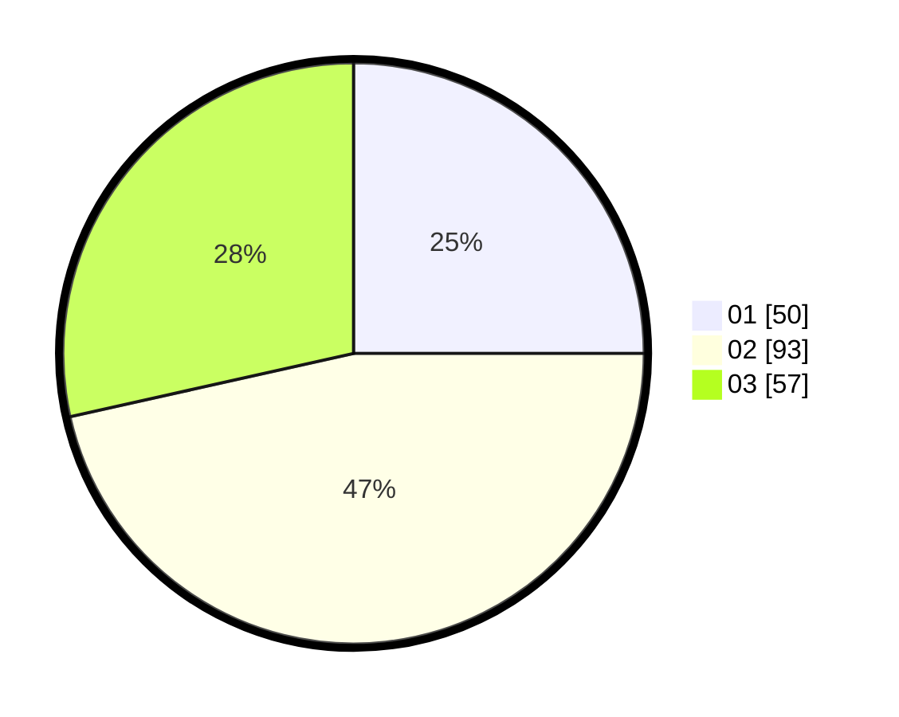

# Hasil

Hasil perolehan suara paslon dapat dilihat pada file paslon-01.txt, paslon-02.txt, dan paslon-03.txt.

Jika tidak ada, artinya data tersebut belum ada pada SIREKAP.

## Perolehan Suara

 * Paslon 01: **50**.
 * Paslon 02: **93**.
 * Paslon 03: **57**.

## Foto C Plano

https://sirekap-obj-formc.kpu.go.id/356e/pemilu/ppwp/31/71/02/10/02/3171021002077-20240216-003202--00dccaa3-2dc8-42f9-8faf-bcaeffd52405.jpg

https://sirekap-obj-formc.kpu.go.id/356e/pemilu/ppwp/31/71/02/10/02/3171021002077-20240216-003204--a65fc8fa-b208-434d-a732-f7e937829f4e.jpg

https://sirekap-obj-formc.kpu.go.id/356e/pemilu/ppwp/31/71/02/10/02/3171021002077-20240216-003202--93150b93-2937-4739-96d1-4a79fdd079a3.jpg

## DATA PEMILIH TETAP

Jumlah pemilih dalam DPT: **283**.
 * L: **136**.
 * P: **147**.

## DATA PENGGUNA HAK PILIH

Jumlah pengguna hak pilih dalam DPT: **202**.
 * L: **96**.
 * P: **106**.

Jumlah pengguna hak pilih dalam DPTb: **1**.
 * L: **0**.
 * P: **1**.

Jumlah pengguna hak pilih dalam DPK: **0**.
 * L: **0**.
 * P: **0**.

Jumlah pengguna hak pilih: **203**.
 * L: **96**.
 * P: **107**.

## JUMLAH SUARA SAH DAN TIDAK SAH

JUMLAH SELURUH SUARA SAH: **200**.

JUMLAH SUARA TIDAK SAH: **3**.

JUMLAH SELURUH SUARA SAH DAN SUARA TIDAK SAH: **203**.
