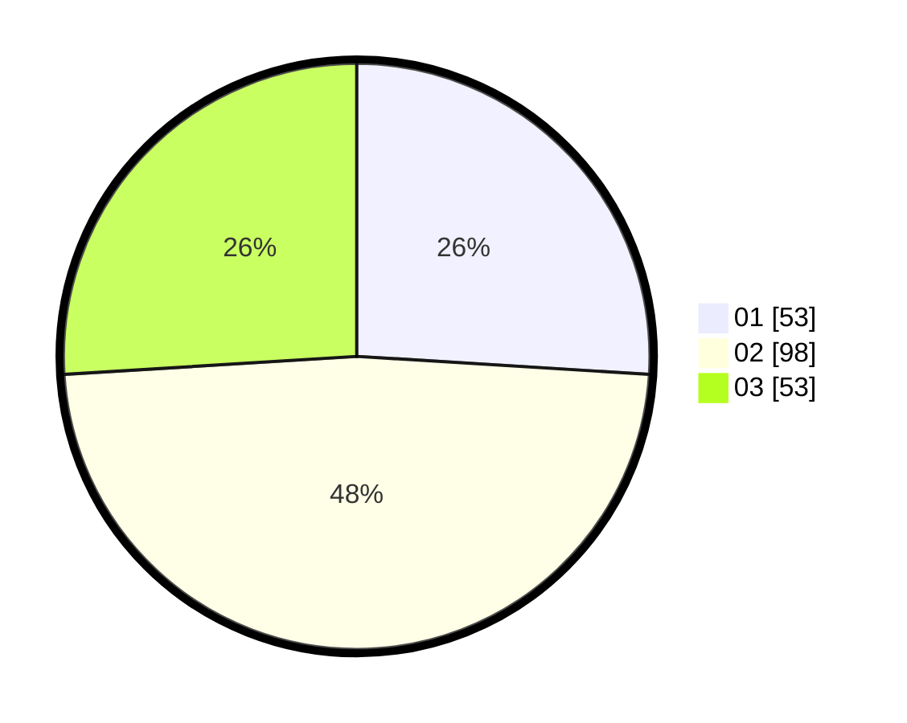

# Hasil

Hasil perolehan suara paslon dapat dilihat pada file paslon-01.txt, paslon-02.txt, dan paslon-03.txt.

Jika tidak ada, artinya data tersebut belum ada pada SIREKAP.

## Perolehan Suara

 * Paslon 01: **53**.
 * Paslon 02: **98**.
 * Paslon 03: **53**.

## Foto C Plano

https://sirekap-obj-formc.kpu.go.id/7dda/pemilu/ppwp/31/71/02/10/02/3171021002078-20240216-160001--fcbd6e45-e9dd-4fd8-92ef-fca7cd8076f3.jpg

https://sirekap-obj-formc.kpu.go.id/7dda/pemilu/ppwp/31/71/02/10/02/3171021002078-20240216-160002--4e916e97-768a-4763-a516-2bdc0c6b3236.jpg

https://sirekap-obj-formc.kpu.go.id/7dda/pemilu/ppwp/31/71/02/10/02/3171021002078-20240216-160001--837123ef-4a8d-4a6c-b55b-751b41b0ec41.jpg

## DATA PEMILIH TETAP

Jumlah pemilih dalam DPT: **274**.
 * L: **136**.
 * P: **138**.

## DATA PENGGUNA HAK PILIH

Jumlah pengguna hak pilih dalam DPT: **202**.
 * L: **90**.
 * P: **112**.

Jumlah pengguna hak pilih dalam DPTb: **3**.
 * L: **1**.
 * P: **2**.

Jumlah pengguna hak pilih dalam DPK: **1**.
 * L: **0**.
 * P: **1**.

Jumlah pengguna hak pilih: **206**.
 * L: **91**.
 * P: **115**.

## JUMLAH SUARA SAH DAN TIDAK SAH

JUMLAH SELURUH SUARA SAH: **204**.

JUMLAH SUARA TIDAK SAH: **2**.

JUMLAH SELURUH SUARA SAH DAN SUARA TIDAK SAH: **206**.
