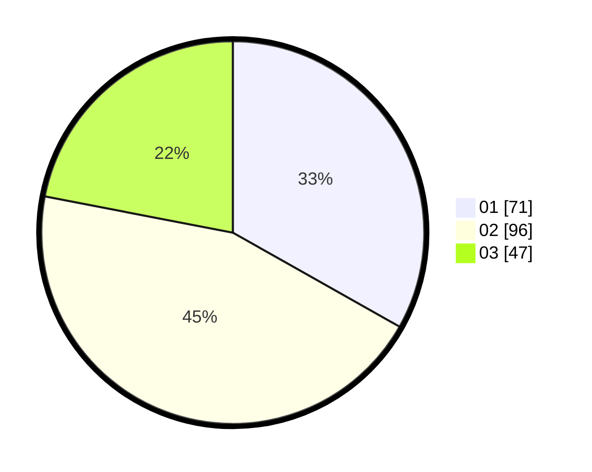

# Hasil

Hasil perolehan suara paslon dapat dilihat pada file paslon-01.txt, paslon-02.txt, dan paslon-03.txt.

Jika tidak ada, artinya data tersebut belum ada pada SIREKAP.

## Perolehan Suara

 * Paslon 01: **71**.
 * Paslon 02: **96**.
 * Paslon 03: **47**.

## Foto C Plano

https://sirekap-obj-formc.kpu.go.id/53c4/pemilu/ppwp/31/71/02/10/02/3171021002079-20240215-211550--075f982a-6fd9-412e-b32c-ca2c086f0fda.jpg

https://sirekap-obj-formc.kpu.go.id/53c4/pemilu/ppwp/31/71/02/10/02/3171021002079-20240215-211552--3f1798f1-b867-4df1-b03d-c5e61aa83476.jpg

https://sirekap-obj-formc.kpu.go.id/53c4/pemilu/ppwp/31/71/02/10/02/3171021002079-20240215-211551--54e26c27-21d7-4043-8f5a-f1a2ed0bb49d.jpg

## DATA PEMILIH TETAP

Jumlah pemilih dalam DPT: **286**.
 * L: **139**.
 * P: **147**.

## DATA PENGGUNA HAK PILIH

Jumlah pengguna hak pilih dalam DPT: **214**.
 * L: **106**.
 * P: **108**.

Jumlah pengguna hak pilih dalam DPTb: **0**.
 * L: **0**.
 * P: **0**.

Jumlah pengguna hak pilih dalam DPK: **1**.
 * L: **1**.
 * P: **0**.

Jumlah pengguna hak pilih: **215**.
 * L: **107**.
 * P: **108**.

## JUMLAH SUARA SAH DAN TIDAK SAH

JUMLAH SELURUH SUARA SAH: **214**.

JUMLAH SUARA TIDAK SAH: **1**.

JUMLAH SELURUH SUARA SAH DAN SUARA TIDAK SAH: **215**.
