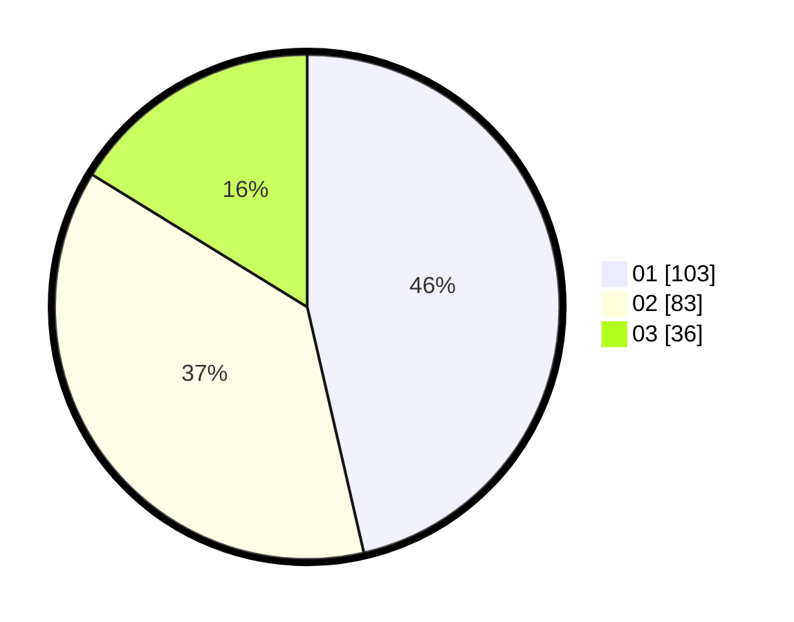

# Hasil

Hasil perolehan suara paslon dapat dilihat pada file paslon-01.txt, paslon-02.txt, dan paslon-03.txt.

Jika tidak ada, artinya data tersebut belum ada pada SIREKAP.

## Perolehan Suara

 * Paslon 01: **103**.
 * Paslon 02: **83**.
 * Paslon 03: **36**.

## Foto C Plano

https://sirekap-obj-formc.kpu.go.id/37c8/pemilu/ppwp/31/71/02/10/02/3171021002083-20240215-232557--cabc333f-d4ce-4cfd-b195-669e10a9b701.jpg

https://sirekap-obj-formc.kpu.go.id/37c8/pemilu/ppwp/31/71/02/10/02/3171021002083-20240215-232600--2f5f81a9-aedb-4d35-ada5-4f6f5e5cc28d.jpg

https://sirekap-obj-formc.kpu.go.id/37c8/pemilu/ppwp/31/71/02/10/02/3171021002083-20240215-232558--595ae51d-e60a-4747-99a2-0732700338ec.jpg

## DATA PEMILIH TETAP

Jumlah pemilih dalam DPT: **287**.
 * L: **141**.
 * P: **146**.

## DATA PENGGUNA HAK PILIH

Jumlah pengguna hak pilih dalam DPT: **217**.
 * L: **103**.
 * P: **114**.

Jumlah pengguna hak pilih dalam DPTb: **7**.
 * L: **4**.
 * P: **3**.

Jumlah pengguna hak pilih dalam DPK: **1**.
 * L: **1**.
 * P: **0**.

Jumlah pengguna hak pilih: **225**.
 * L: **108**.
 * P: **117**.

## JUMLAH SUARA SAH DAN TIDAK SAH

JUMLAH SELURUH SUARA SAH: **222**.

JUMLAH SUARA TIDAK SAH: **3**.

JUMLAH SELURUH SUARA SAH DAN SUARA TIDAK SAH: **225**.
