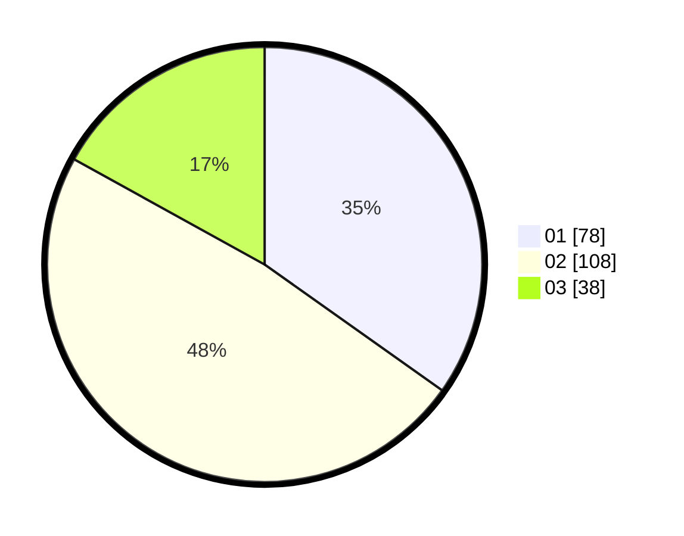

# Hasil

Hasil perolehan suara paslon dapat dilihat pada file paslon-01.txt, paslon-02.txt, dan paslon-03.txt.

Jika tidak ada, artinya data tersebut belum ada pada SIREKAP.

## Perolehan Suara

 * Paslon 01: **78**.
 * Paslon 02: **108**.
 * Paslon 03: **38**.

## Foto C Plano

https://sirekap-obj-formc.kpu.go.id/d57b/pemilu/ppwp/31/71/02/10/02/3171021002084-20240216-214710--7a8d5c1b-8d45-4d6c-8d0f-5390ab92b7ba.jpg

https://sirekap-obj-formc.kpu.go.id/d57b/pemilu/ppwp/31/71/02/10/02/3171021002084-20240216-214712--9df7d98c-2e24-4feb-924e-bf9f7c4f0e1b.jpg

https://sirekap-obj-formc.kpu.go.id/d57b/pemilu/ppwp/31/71/02/10/02/3171021002084-20240216-214711--b566c2da-9121-49ae-adfe-702f764e4233.jpg

## DATA PEMILIH TETAP

Jumlah pemilih dalam DPT: **288**.
 * L: **140**.
 * P: **148**.

## DATA PENGGUNA HAK PILIH

Jumlah pengguna hak pilih dalam DPT: **222**.
 * L: **103**.
 * P: **119**.

Jumlah pengguna hak pilih dalam DPTb: **7**.
 * L: **4**.
 * P: **3**.

Jumlah pengguna hak pilih dalam DPK: **0**.
 * L: **0**.
 * P: **0**.

Jumlah pengguna hak pilih: **229**.
 * L: **107**.
 * P: **122**.

## JUMLAH SUARA SAH DAN TIDAK SAH

JUMLAH SELURUH SUARA SAH: **224**.

JUMLAH SUARA TIDAK SAH: **5**.

JUMLAH SELURUH SUARA SAH DAN SUARA TIDAK SAH: **229**.
