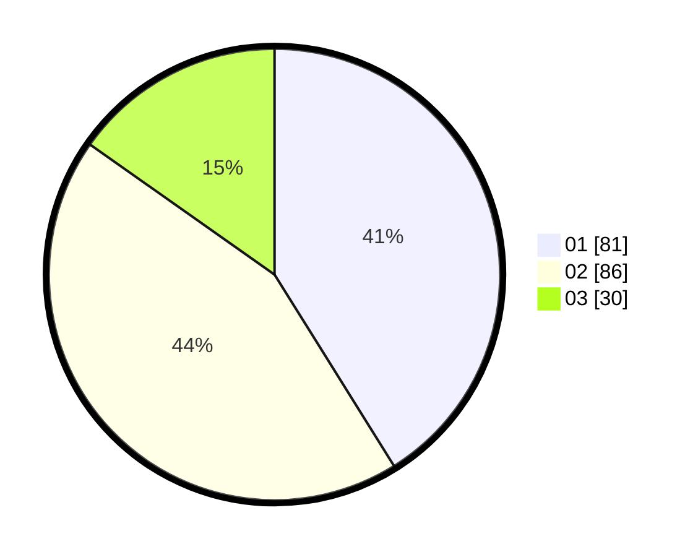

# Hasil

Hasil perolehan suara paslon dapat dilihat pada file paslon-01.txt, paslon-02.txt, dan paslon-03.txt.

Jika tidak ada, artinya data tersebut belum ada pada SIREKAP.

## Perolehan Suara

 * Paslon 01: **81**.
 * Paslon 02: **86**.
 * Paslon 03: **30**.

## Foto C Plano

https://sirekap-obj-formc.kpu.go.id/05d5/pemilu/ppwp/31/71/02/10/02/3171021002085-20240216-001739--7ae145e9-d7cb-46a2-9fb2-7b597cf14743.jpg

https://sirekap-obj-formc.kpu.go.id/05d5/pemilu/ppwp/31/71/02/10/02/3171021002085-20240216-001740--22629f35-bc37-4161-853c-2baf346f3483.jpg

https://sirekap-obj-formc.kpu.go.id/05d5/pemilu/ppwp/31/71/02/10/02/3171021002085-20240216-001740--90de4e72-9f94-4f02-a7e0-317340b7747e.jpg

## DATA PEMILIH TETAP

Jumlah pemilih dalam DPT: **284**.
 * L: **146**.
 * P: **138**.

## DATA PENGGUNA HAK PILIH

Jumlah pengguna hak pilih dalam DPT: **194**.
 * L: **102**.
 * P: **92**.

Jumlah pengguna hak pilih dalam DPTb: **6**.
 * L: **3**.
 * P: **3**.

Jumlah pengguna hak pilih dalam DPK: **1**.
 * L: **1**.
 * P: **0**.

Jumlah pengguna hak pilih: **201**.
 * L: **106**.
 * P: **95**.

## JUMLAH SUARA SAH DAN TIDAK SAH

JUMLAH SELURUH SUARA SAH: **197**.

JUMLAH SUARA TIDAK SAH: **4**.

JUMLAH SELURUH SUARA SAH DAN SUARA TIDAK SAH: **201**.
