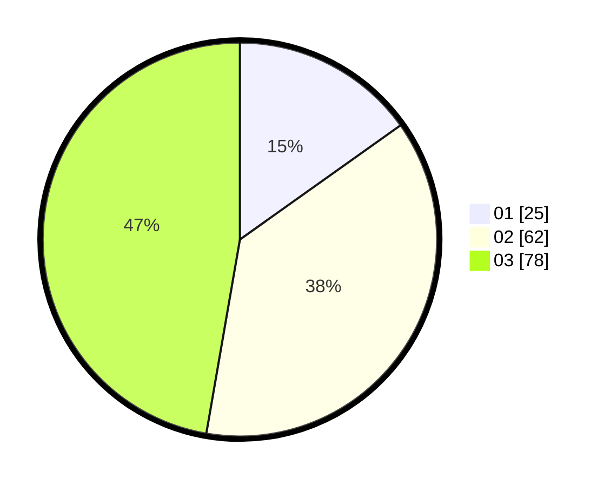

# Hasil

Hasil perolehan suara paslon dapat dilihat pada file paslon-01.txt, paslon-02.txt, dan paslon-03.txt.

Jika tidak ada, artinya data tersebut belum ada pada SIREKAP.

## Perolehan Suara

 * Paslon 01: **25**.
 * Paslon 02: **62**.
 * Paslon 03: **78**.

## Foto C Plano

https://sirekap-obj-formc.kpu.go.id/c3fd/pemilu/ppwp/31/71/02/10/02/3171021002087-20240216-132858--cceb9295-2326-4448-90c7-f061fdf9dd97.jpg

https://sirekap-obj-formc.kpu.go.id/c3fd/pemilu/ppwp/31/71/02/10/02/3171021002087-20240216-132859--02aa0106-13fc-427b-83a8-7a67cd075803.jpg

https://sirekap-obj-formc.kpu.go.id/c3fd/pemilu/ppwp/31/71/02/10/02/3171021002087-20240216-132859--2ac8c477-9738-4621-abd3-7b6f62a16125.jpg

## DATA PEMILIH TETAP

Jumlah pemilih dalam DPT: **246**.
 * L: **126**.
 * P: **120**.

## DATA PENGGUNA HAK PILIH

Jumlah pengguna hak pilih dalam DPT: **147**.
 * L: **76**.
 * P: **71**.

Jumlah pengguna hak pilih dalam DPTb: **13**.
 * L: **8**.
 * P: **5**.

Jumlah pengguna hak pilih dalam DPK: **5**.
 * L: **1**.
 * P: **4**.

Jumlah pengguna hak pilih: **165**.
 * L: **85**.
 * P: **80**.

## JUMLAH SUARA SAH DAN TIDAK SAH

JUMLAH SELURUH SUARA SAH: **165**.

JUMLAH SUARA TIDAK SAH: **0**.

JUMLAH SELURUH SUARA SAH DAN SUARA TIDAK SAH: **165**.
