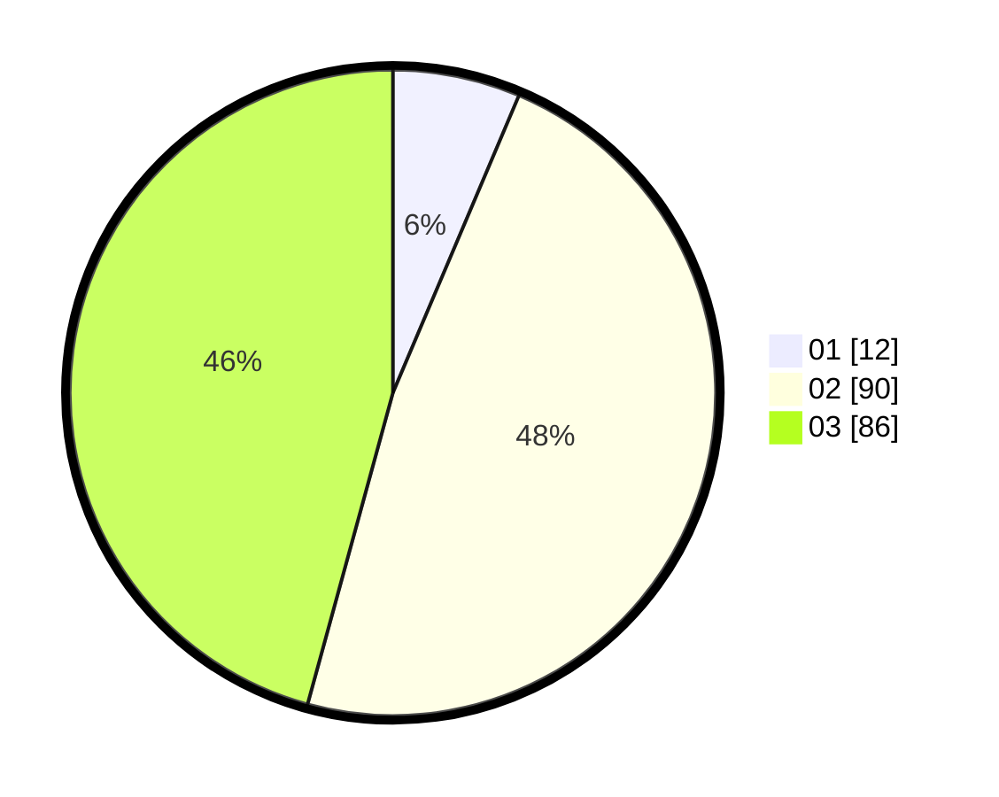

# Hasil

Hasil perolehan suara paslon dapat dilihat pada file paslon-01.txt, paslon-02.txt, dan paslon-03.txt.

Jika tidak ada, artinya data tersebut belum ada pada SIREKAP.

## Perolehan Suara

 * Paslon 01: **12**.
 * Paslon 02: **90**.
 * Paslon 03: **86**.

## Foto C Plano

https://sirekap-obj-formc.kpu.go.id/febc/pemilu/ppwp/31/71/02/10/03/3171021003001-20240216-193446--f34ad409-9ba7-4222-8e1d-b1c90520fdb6.jpg

https://sirekap-obj-formc.kpu.go.id/febc/pemilu/ppwp/31/71/02/10/03/3171021003001-20240217-112603--0a92f601-88cc-4d16-8606-b449b96e88af.jpg

https://sirekap-obj-formc.kpu.go.id/febc/pemilu/ppwp/31/71/02/10/03/3171021003001-20240217-104040--a18d099c-8c60-4a22-bfc0-6ce4f84e09cd.jpg

## DATA PEMILIH TETAP

Jumlah pemilih dalam DPT: **259**.
 * L: **126**.
 * P: **133**.

## DATA PENGGUNA HAK PILIH

Jumlah pengguna hak pilih dalam DPT: **181**.
 * L: **90**.
 * P: **91**.

Jumlah pengguna hak pilih dalam DPTb: **10**.
 * L: **1**.
 * P: **9**.

Jumlah pengguna hak pilih dalam DPK: **2**.
 * L: **2**.
 * P: **0**.

Jumlah pengguna hak pilih: **193**.
 * L: **93**.
 * P: **100**.

## JUMLAH SUARA SAH DAN TIDAK SAH

JUMLAH SELURUH SUARA SAH: **188**.

JUMLAH SUARA TIDAK SAH: **5**.

JUMLAH SELURUH SUARA SAH DAN SUARA TIDAK SAH: **193**.
