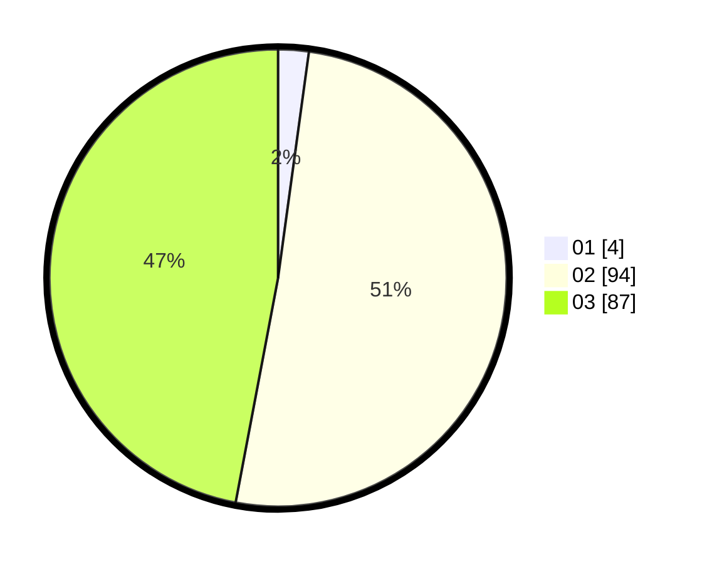

# Hasil

Hasil perolehan suara paslon dapat dilihat pada file paslon-01.txt, paslon-02.txt, dan paslon-03.txt.

Jika tidak ada, artinya data tersebut belum ada pada SIREKAP.

## Perolehan Suara

 * Paslon 01: **4**.
 * Paslon 02: **94**.
 * Paslon 03: **87**.

## Foto C Plano

https://sirekap-obj-formc.kpu.go.id/ab06/pemilu/ppwp/31/71/02/10/03/3171021003004-20240216-230719--a14cf2f6-69f9-4fbc-a158-9b995f1ce7d1.jpg

https://sirekap-obj-formc.kpu.go.id/ab06/pemilu/ppwp/31/71/02/10/03/3171021003004-20240216-231028--c84e5c05-cc3f-400c-902b-ac25b7c794c8.jpg

https://sirekap-obj-formc.kpu.go.id/ab06/pemilu/ppwp/31/71/02/10/03/3171021003004-20240216-225923--5471f4db-57f2-4cf4-8b7a-c1287b52b063.jpg

## DATA PEMILIH TETAP

Jumlah pemilih dalam DPT: **264**.
 * L: **123**.
 * P: **141**.

## DATA PENGGUNA HAK PILIH

Jumlah pengguna hak pilih dalam DPT: **186**.
 * L: **87**.
 * P: **99**.

Jumlah pengguna hak pilih dalam DPTb: **1**.
 * L: **0**.
 * P: **1**.

Jumlah pengguna hak pilih dalam DPK: **0**.
 * L: **0**.
 * P: **0**.

Jumlah pengguna hak pilih: **187**.
 * L: **87**.
 * P: **100**.

## JUMLAH SUARA SAH DAN TIDAK SAH

JUMLAH SELURUH SUARA SAH: **185**.

JUMLAH SUARA TIDAK SAH: **2**.

JUMLAH SELURUH SUARA SAH DAN SUARA TIDAK SAH: **187**.
