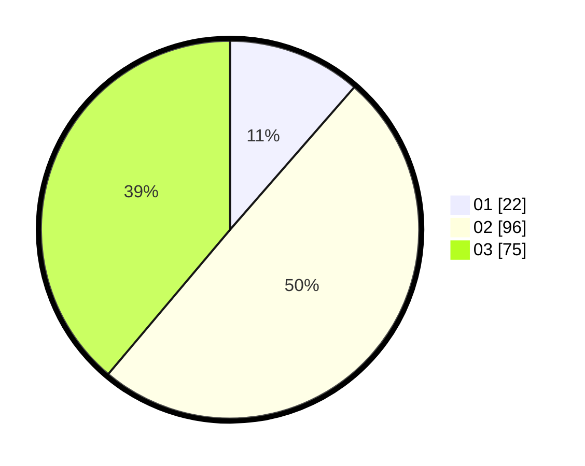

# Hasil

Hasil perolehan suara paslon dapat dilihat pada file paslon-01.txt, paslon-02.txt, dan paslon-03.txt.

Jika tidak ada, artinya data tersebut belum ada pada SIREKAP.

## Perolehan Suara

 * Paslon 01: **22**.
 * Paslon 02: **96**.
 * Paslon 03: **75**.

## Foto C Plano

https://sirekap-obj-formc.kpu.go.id/350c/pemilu/ppwp/31/71/02/10/03/3171021003005-20240217-180331--0e282064-c703-41cf-bdae-bfb302ba5f48.jpg

https://sirekap-obj-formc.kpu.go.id/350c/pemilu/ppwp/31/71/02/10/03/3171021003005-20240217-180504--28d244f1-9a87-4ccf-8eec-5005db4838db.jpg

https://sirekap-obj-formc.kpu.go.id/350c/pemilu/ppwp/31/71/02/10/03/3171021003005-20240217-180755--e869fc59-88c8-424d-999d-7d39a7113f49.jpg

## DATA PEMILIH TETAP

Jumlah pemilih dalam DPT: **273**.
 * L: **129**.
 * P: **144**.

## DATA PENGGUNA HAK PILIH

Jumlah pengguna hak pilih dalam DPT: **195**.
 * L: **90**.
 * P: **105**.

Jumlah pengguna hak pilih dalam DPTb: **1**.
 * L: **1**.
 * P: **0**.

Jumlah pengguna hak pilih dalam DPK: **1**.
 * L: **1**.
 * P: **0**.

Jumlah pengguna hak pilih: **197**.
 * L: **92**.
 * P: **105**.

## JUMLAH SUARA SAH DAN TIDAK SAH

JUMLAH SELURUH SUARA SAH: **193**.

JUMLAH SUARA TIDAK SAH: **3**.

JUMLAH SELURUH SUARA SAH DAN SUARA TIDAK SAH: **196**.
