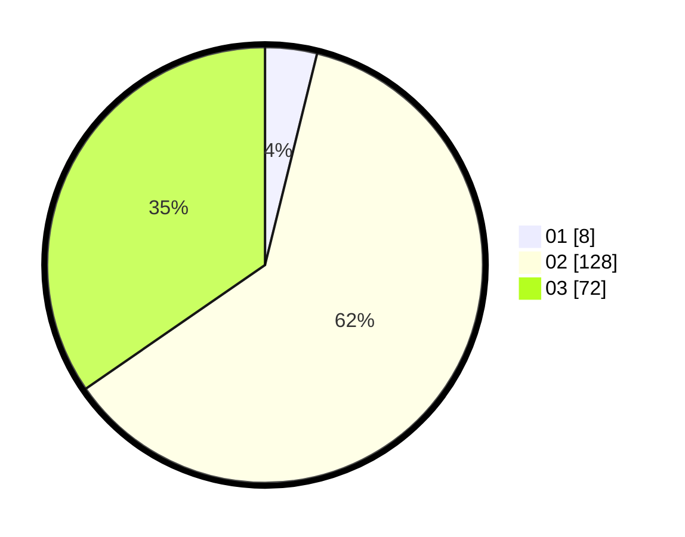

# Hasil

Hasil perolehan suara paslon dapat dilihat pada file paslon-01.txt, paslon-02.txt, dan paslon-03.txt.

Jika tidak ada, artinya data tersebut belum ada pada SIREKAP.

## Perolehan Suara

 * Paslon 01: **8**.
 * Paslon 02: **128**.
 * Paslon 03: **72**.

## Foto C Plano

https://sirekap-obj-formc.kpu.go.id/309f/pemilu/ppwp/31/71/02/10/03/3171021003007-20240214-190124--2f352c25-87ad-4c9f-a20e-e02dad46e79f.jpg

https://sirekap-obj-formc.kpu.go.id/309f/pemilu/ppwp/31/71/02/10/03/3171021003007-20240214-193810--4a9a77fc-289e-4052-a1da-91e24deb4fdf.jpg

https://sirekap-obj-formc.kpu.go.id/309f/pemilu/ppwp/31/71/02/10/03/3171021003007-20240214-192715--1f68f650-86cd-4dff-8cc3-cd860d777c63.jpg

## DATA PEMILIH TETAP

Jumlah pemilih dalam DPT: **269**.
 * L: **128**.
 * P: **141**.

## DATA PENGGUNA HAK PILIH

Jumlah pengguna hak pilih dalam DPT: **205**.
 * L: **91**.
 * P: **114**.

Jumlah pengguna hak pilih dalam DPTb: **3**.
 * L: **3**.
 * P: **0**.

Jumlah pengguna hak pilih dalam DPK: **1**.
 * L: **0**.
 * P: **1**.

Jumlah pengguna hak pilih: **209**.
 * L: **94**.
 * P: **115**.

## JUMLAH SUARA SAH DAN TIDAK SAH

JUMLAH SELURUH SUARA SAH: **208**.

JUMLAH SUARA TIDAK SAH: **1**.

JUMLAH SELURUH SUARA SAH DAN SUARA TIDAK SAH: **209**.
