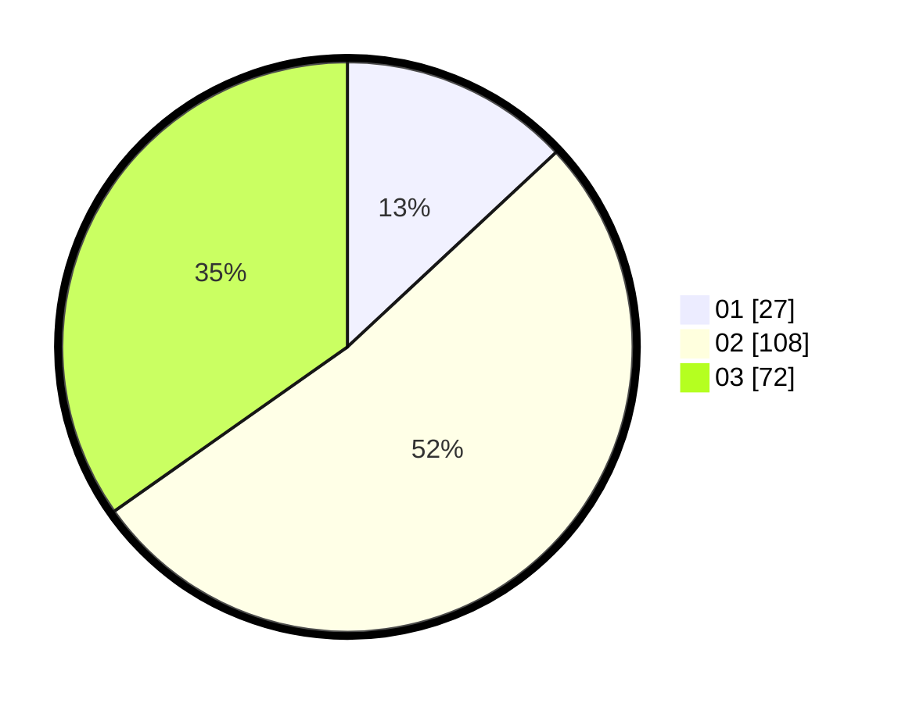

# Hasil

Hasil perolehan suara paslon dapat dilihat pada file paslon-01.txt, paslon-02.txt, dan paslon-03.txt.

Jika tidak ada, artinya data tersebut belum ada pada SIREKAP.

## Perolehan Suara

 * Paslon 01: **27**.
 * Paslon 02: **108**.
 * Paslon 03: **72**.

## Foto C Plano

https://sirekap-obj-formc.kpu.go.id/c0c8/pemilu/ppwp/31/71/02/10/03/3171021003008-20240214-203026--45006a72-0799-4ba9-848a-890b15dbde00.jpg

https://sirekap-obj-formc.kpu.go.id/c0c8/pemilu/ppwp/31/71/02/10/03/3171021003008-20240214-212426--ceba65c2-483c-44ae-8316-b322c352f7f8.jpg
