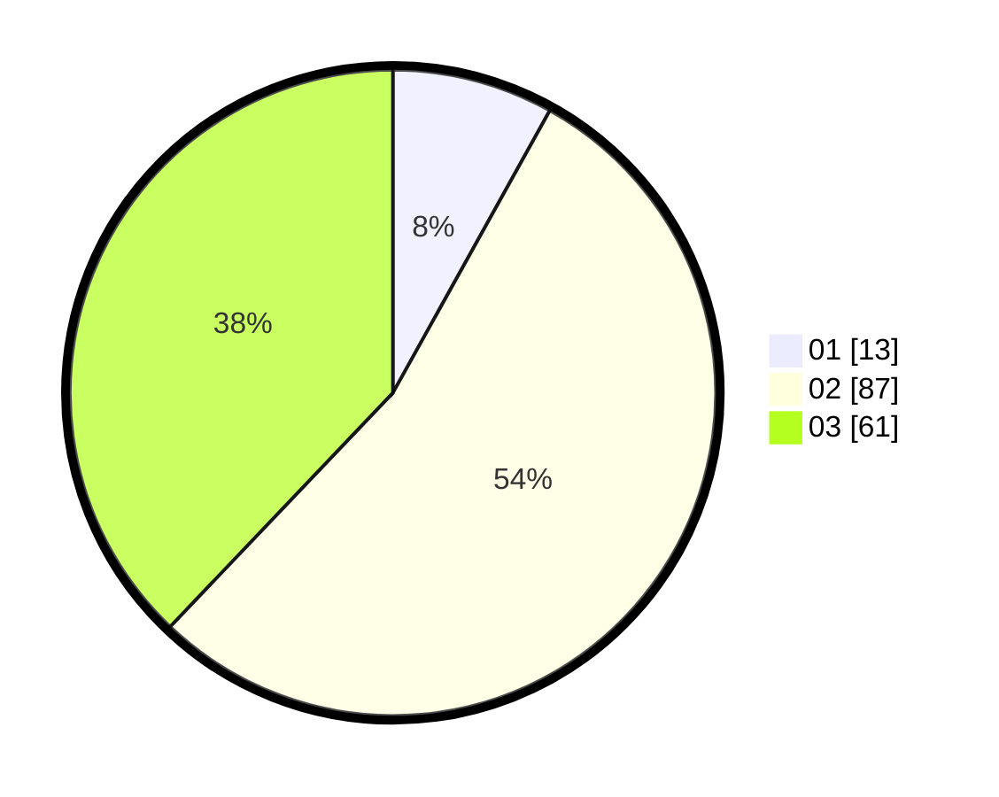

# Hasil

Hasil perolehan suara paslon dapat dilihat pada file paslon-01.txt, paslon-02.txt, dan paslon-03.txt.

Jika tidak ada, artinya data tersebut belum ada pada SIREKAP.

## Perolehan Suara

 * Paslon 01: **13**.
 * Paslon 02: **87**.
 * Paslon 03: **61**.

## Foto C Plano

https://sirekap-obj-formc.kpu.go.id/64c7/pemilu/ppwp/31/71/02/10/03/3171021003016-20240218-154240--7e1afde0-199e-4dad-a31e-02cdc89ba642.jpg

https://sirekap-obj-formc.kpu.go.id/64c7/pemilu/ppwp/31/71/02/10/03/3171021003016-20240218-154242--f335e915-c357-42b0-94a7-9dd93a257093.jpg

https://sirekap-obj-formc.kpu.go.id/64c7/pemilu/ppwp/31/71/02/10/03/3171021003016-20240218-154241--7d51e7df-0f2f-4afa-bd7f-8fc83fadcbda.jpg

## DATA PEMILIH TETAP

Jumlah pemilih dalam DPT: **268**.
 * L: **121**.
 * P: **147**.

## DATA PENGGUNA HAK PILIH

Jumlah pengguna hak pilih dalam DPT: **191**.
 * L: **84**.
 * P: **107**.

Jumlah pengguna hak pilih dalam DPTb: **1**.
 * L: **1**.
 * P: **0**.

Jumlah pengguna hak pilih dalam DPK: **3**.
 * L: **2**.
 * P: **1**.

Jumlah pengguna hak pilih: **195**.
 * L: **87**.
 * P: **108**.

## JUMLAH SUARA SAH DAN TIDAK SAH

JUMLAH SELURUH SUARA SAH: **191**.

JUMLAH SUARA TIDAK SAH: **4**.

JUMLAH SELURUH SUARA SAH DAN SUARA TIDAK SAH: **195**.
