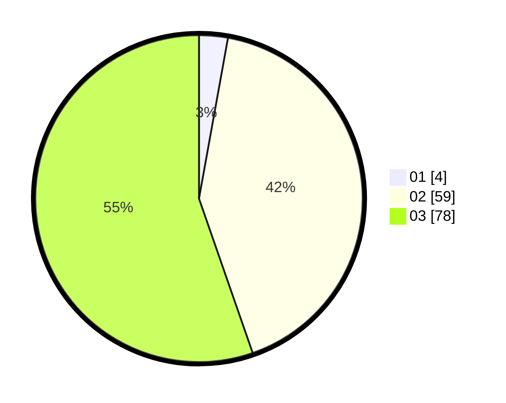

# Hasil

Hasil perolehan suara paslon dapat dilihat pada file paslon-01.txt, paslon-02.txt, dan paslon-03.txt.

Jika tidak ada, artinya data tersebut belum ada pada SIREKAP.

## Perolehan Suara

 * Paslon 01: **4**.
 * Paslon 02: **59**.
 * Paslon 03: **78**.

## Foto C Plano

https://sirekap-obj-formc.kpu.go.id/ed76/pemilu/ppwp/31/71/02/10/03/3171021003019-20240218-084507--188d1a7b-e555-49f8-92e7-5f7cc23a0bf2.jpg

https://sirekap-obj-formc.kpu.go.id/ed76/pemilu/ppwp/31/71/02/10/03/3171021003019-20240218-085509--74ab70d3-78e0-4e14-be1f-9c5ffe60961b.jpg

https://sirekap-obj-formc.kpu.go.id/ed76/pemilu/ppwp/31/71/02/10/03/3171021003019-20240218-085738--68d935ac-1198-439c-874b-191719cf3ba3.jpg

## DATA PEMILIH TETAP

Jumlah pemilih dalam DPT: **244**.
 * L: **117**.
 * P: **127**.

## DATA PENGGUNA HAK PILIH

Jumlah pengguna hak pilih dalam DPT: **136**.
 * L: **65**.
 * P: **71**.

Jumlah pengguna hak pilih dalam DPTb: **4**.
 * L: **1**.
 * P: **3**.

Jumlah pengguna hak pilih dalam DPK: **1**.
 * L: **1**.
 * P: **0**.

Jumlah pengguna hak pilih: **141**.
 * L: **67**.
 * P: **74**.

## JUMLAH SUARA SAH DAN TIDAK SAH

JUMLAH SELURUH SUARA SAH: **141**.

JUMLAH SUARA TIDAK SAH: **0**.

JUMLAH SELURUH SUARA SAH DAN SUARA TIDAK SAH: **141**.
