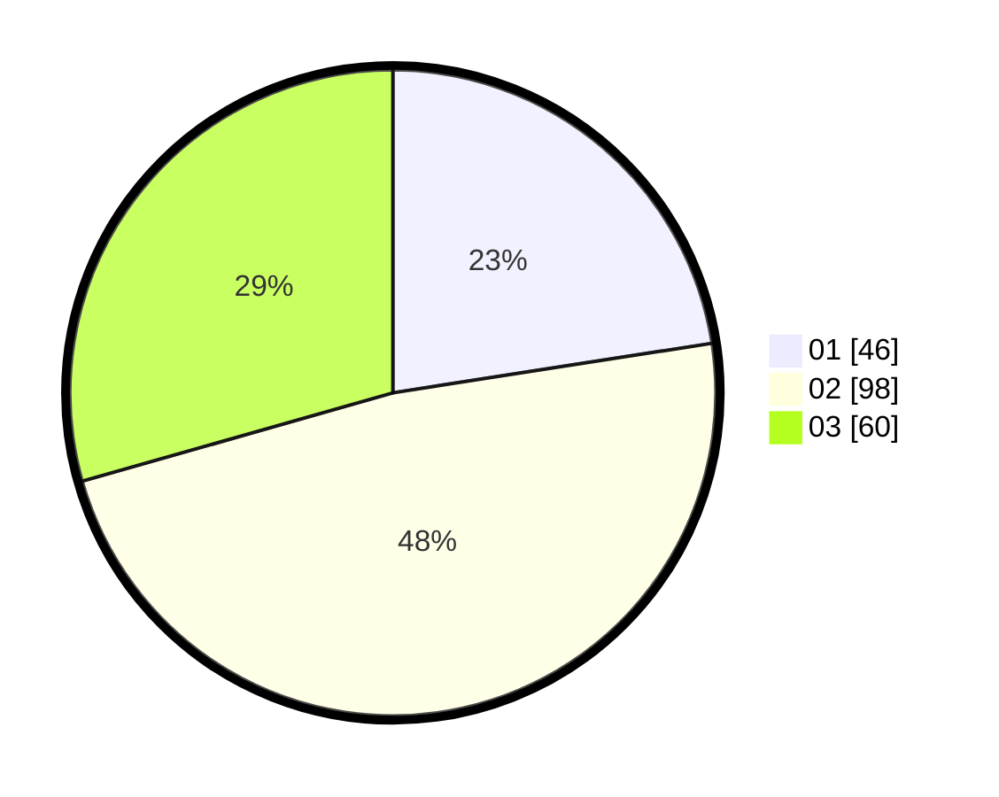

# Hasil

Hasil perolehan suara paslon dapat dilihat pada file paslon-01.txt, paslon-02.txt, dan paslon-03.txt.

Jika tidak ada, artinya data tersebut belum ada pada SIREKAP.

## Perolehan Suara

 * Paslon 01: **46**.
 * Paslon 02: **98**.
 * Paslon 03: **60**.

## Foto C Plano

https://sirekap-obj-formc.kpu.go.id/07b7/pemilu/ppwp/31/71/02/10/03/3171021003020-20240216-221933--9c502c07-cf62-4142-9f47-da10faeb7171.jpg

https://sirekap-obj-formc.kpu.go.id/07b7/pemilu/ppwp/31/71/02/10/03/3171021003020-20240214-212835--36a9d934-e3ec-4612-85b6-b608091780d9.jpg

https://sirekap-obj-formc.kpu.go.id/07b7/pemilu/ppwp/31/71/02/10/03/3171021003020-20240215-021540--665a03a8-0f9d-4ddc-8478-1ce0c1c261f6.jpg
