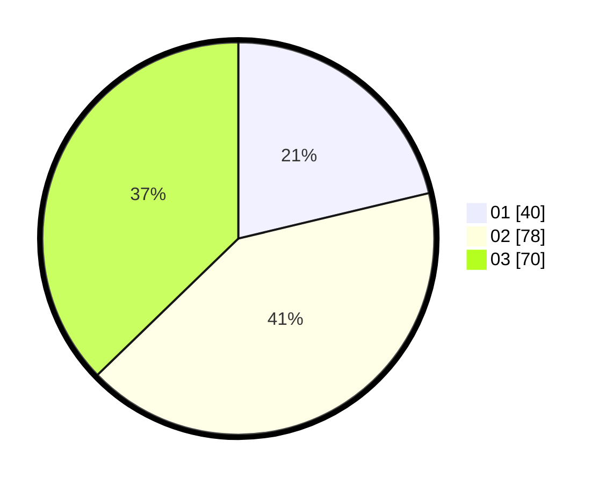

# Hasil

Hasil perolehan suara paslon dapat dilihat pada file paslon-01.txt, paslon-02.txt, dan paslon-03.txt.

Jika tidak ada, artinya data tersebut belum ada pada SIREKAP.

## Perolehan Suara

 * Paslon 01: **40**.
 * Paslon 02: **78**.
 * Paslon 03: **70**.

## Foto C Plano

https://sirekap-obj-formc.kpu.go.id/c379/pemilu/ppwp/31/71/02/10/03/3171021003021-20240215-000739--efde731b-aad3-4a69-b954-911145a0f83d.jpg

https://sirekap-obj-formc.kpu.go.id/c379/pemilu/ppwp/31/71/02/10/03/3171021003021-20240215-000841--c6826cc9-a31e-4e88-a5a5-a5040b8f4149.jpg

https://sirekap-obj-formc.kpu.go.id/c379/pemilu/ppwp/31/71/02/10/03/3171021003021-20240215-000931--56be4b4f-110a-417d-aaec-b5798d76769e.jpg

## DATA PEMILIH TETAP

Jumlah pemilih dalam DPT: **190**.
 * L: **90**.
 * P: **100**.

## DATA PENGGUNA HAK PILIH

Jumlah pengguna hak pilih dalam DPT: **175**.
 * L: **84**.
 * P: **91**.

Jumlah pengguna hak pilih dalam DPTb: **13**.
 * L: **5**.
 * P: **8**.

Jumlah pengguna hak pilih dalam DPK: **2**.
 * L: **1**.
 * P: **1**.

Jumlah pengguna hak pilih: **190**.
 * L: **90**.
 * P: **100**.

## JUMLAH SUARA SAH DAN TIDAK SAH

JUMLAH SELURUH SUARA SAH: **188**.

JUMLAH SUARA TIDAK SAH: **2**.

JUMLAH SELURUH SUARA SAH DAN SUARA TIDAK SAH: **190**.
