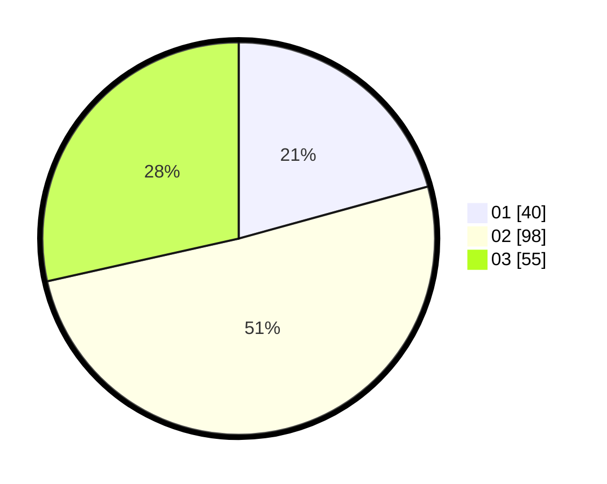

# Hasil

Hasil perolehan suara paslon dapat dilihat pada file paslon-01.txt, paslon-02.txt, dan paslon-03.txt.

Jika tidak ada, artinya data tersebut belum ada pada SIREKAP.

## Perolehan Suara

 * Paslon 01: **40**.
 * Paslon 02: **98**.
 * Paslon 03: **55**.

## Foto C Plano

https://sirekap-obj-formc.kpu.go.id/e654/pemilu/ppwp/31/71/02/10/03/3171021003024-20240214-155516--51649418-c824-4cf6-962b-84b61ca9edac.jpg

https://sirekap-obj-formc.kpu.go.id/e654/pemilu/ppwp/31/71/02/10/03/3171021003024-20240214-155632--9461fa15-bb08-4ea1-97c3-fb9f918f1b03.jpg

https://sirekap-obj-formc.kpu.go.id/e654/pemilu/ppwp/31/71/02/10/03/3171021003024-20240214-155754--b0090237-69a7-449f-a7ca-689e12f3c3d3.jpg

## DATA PEMILIH TETAP

Jumlah pemilih dalam DPT: **271**.
 * L: **139**.
 * P: **132**.

## DATA PENGGUNA HAK PILIH

Jumlah pengguna hak pilih dalam DPT: **192**.
 * L: **94**.
 * P: **98**.

Jumlah pengguna hak pilih dalam DPTb: **3**.
 * L: **0**.
 * P: **3**.

Jumlah pengguna hak pilih dalam DPK: **1**.
 * L: **0**.
 * P: **1**.

Jumlah pengguna hak pilih: **196**.
 * L: **94**.
 * P: **102**.

## JUMLAH SUARA SAH DAN TIDAK SAH

JUMLAH SELURUH SUARA SAH: **193**.

JUMLAH SUARA TIDAK SAH: **3**.

JUMLAH SELURUH SUARA SAH DAN SUARA TIDAK SAH: **196**.
