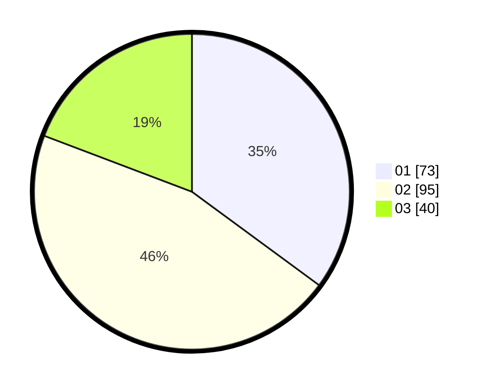

# Hasil

Hasil perolehan suara paslon dapat dilihat pada file paslon-01.txt, paslon-02.txt, dan paslon-03.txt.

Jika tidak ada, artinya data tersebut belum ada pada SIREKAP.

## Perolehan Suara

 * Paslon 01: **73**.
 * Paslon 02: **95**.
 * Paslon 03: **40**.

## Foto C Plano

https://sirekap-obj-formc.kpu.go.id/8d89/pemilu/ppwp/31/71/02/10/03/3171021003025-20240218-121735--c860f123-96cb-4af4-bd5a-859ad57e78ad.jpg

https://sirekap-obj-formc.kpu.go.id/8d89/pemilu/ppwp/31/71/02/10/03/3171021003025-20240214-201705--09573e5b-d237-43fe-be0b-3ba9b8ecc8de.jpg

https://sirekap-obj-formc.kpu.go.id/8d89/pemilu/ppwp/31/71/02/10/03/3171021003025-20240214-201750--bea9e58b-e6f8-4ca9-af42-a823578710ab.jpg

## DATA PEMILIH TETAP

Jumlah pemilih dalam DPT: **265**.
 * L: **131**.
 * P: **134**.

## DATA PENGGUNA HAK PILIH

Jumlah pengguna hak pilih dalam DPT: **201**.
 * L: **92**.
 * P: **109**.

Jumlah pengguna hak pilih dalam DPTb: **4**.
 * L: **2**.
 * P: **2**.

Jumlah pengguna hak pilih dalam DPK: **1**.
 * L: **0**.
 * P: **1**.

Jumlah pengguna hak pilih: **206**.
 * L: **94**.
 * P: **112**.

## JUMLAH SUARA SAH DAN TIDAK SAH

JUMLAH SELURUH SUARA SAH: **208**.

JUMLAH SUARA TIDAK SAH: **1**.

JUMLAH SELURUH SUARA SAH DAN SUARA TIDAK SAH: **209**.
