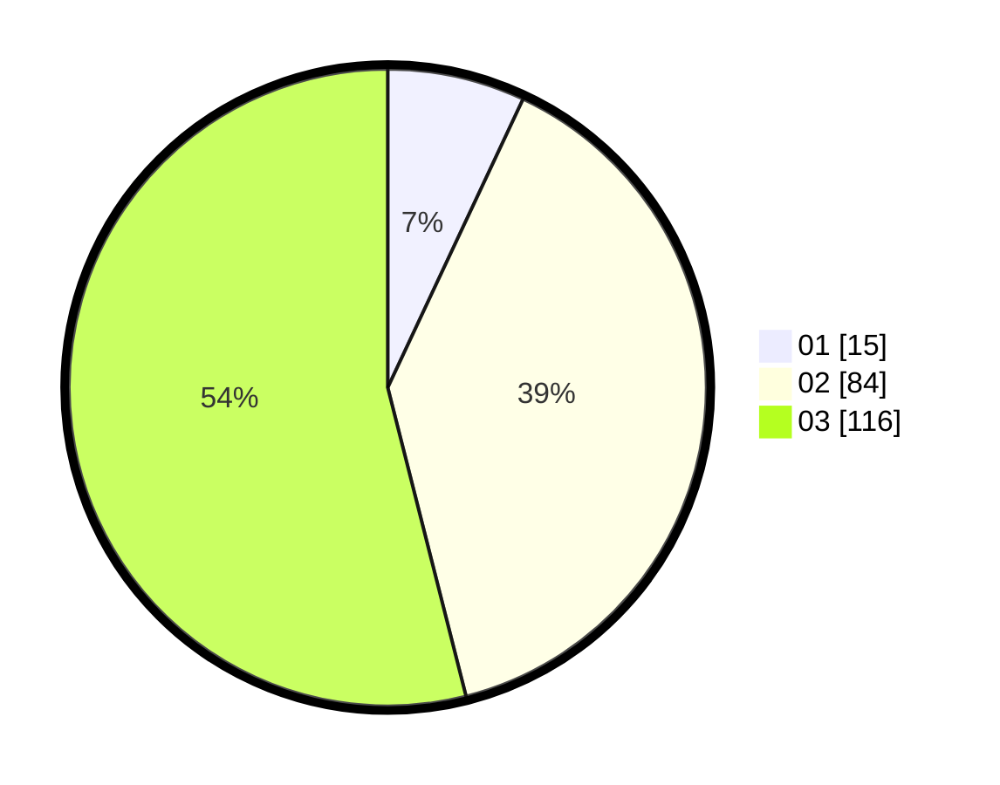

# Hasil

Hasil perolehan suara paslon dapat dilihat pada file paslon-01.txt, paslon-02.txt, dan paslon-03.txt.

Jika tidak ada, artinya data tersebut belum ada pada SIREKAP.

## Perolehan Suara

 * Paslon 01: **15**.
 * Paslon 02: **84**.
 * Paslon 03: **116**.

## Foto C Plano

https://sirekap-obj-formc.kpu.go.id/78b7/pemilu/ppwp/31/71/02/10/03/3171021003031-20240214-230431--f4dd8913-af87-444d-87ea-3ad8dc6cb752.jpg

https://sirekap-obj-formc.kpu.go.id/78b7/pemilu/ppwp/31/71/02/10/03/3171021003031-20240214-230515--1f033cde-5688-459b-a8fb-db850f197733.jpg

https://sirekap-obj-formc.kpu.go.id/78b7/pemilu/ppwp/31/71/02/10/03/3171021003031-20240214-230602--e60ba922-1892-428c-b480-5deac9fb0ed5.jpg

## DATA PEMILIH TETAP

Jumlah pemilih dalam DPT: **291**.
 * L: **131**.
 * P: **160**.

## DATA PENGGUNA HAK PILIH

Jumlah pengguna hak pilih dalam DPT: **211**.
 * L: **96**.
 * P: **115**.

Jumlah pengguna hak pilih dalam DPTb: **2**.
 * L: **1**.
 * P: **1**.

Jumlah pengguna hak pilih dalam DPK: **3**.
 * L: **0**.
 * P: **3**.

Jumlah pengguna hak pilih: **216**.
 * L: **97**.
 * P: **119**.

## JUMLAH SUARA SAH DAN TIDAK SAH

JUMLAH SELURUH SUARA SAH: **215**.

JUMLAH SUARA TIDAK SAH: **1**.

JUMLAH SELURUH SUARA SAH DAN SUARA TIDAK SAH: **216**.
