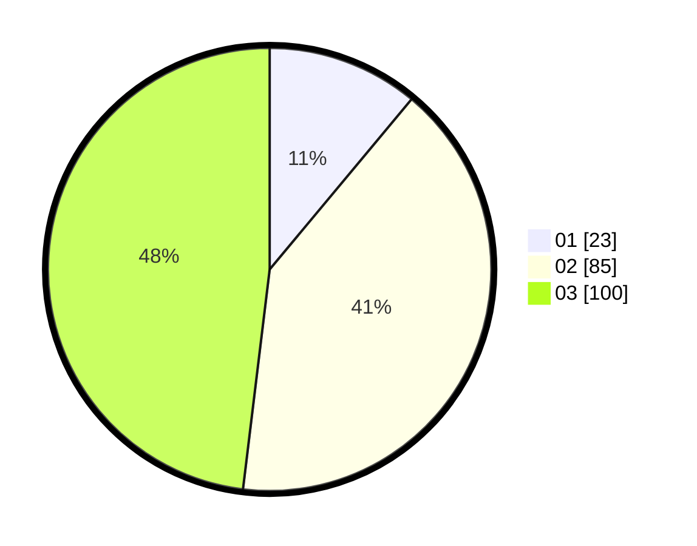

# Hasil

Hasil perolehan suara paslon dapat dilihat pada file paslon-01.txt, paslon-02.txt, dan paslon-03.txt.

Jika tidak ada, artinya data tersebut belum ada pada SIREKAP.

## Perolehan Suara

 * Paslon 01: **23**.
 * Paslon 02: **85**.
 * Paslon 03: **100**.

## Foto C Plano

https://sirekap-obj-formc.kpu.go.id/96b6/pemilu/ppwp/31/71/02/10/03/3171021003032-20240214-190917--16f9dd81-4536-4da3-98b7-0c8f6b3d4137.jpg

https://sirekap-obj-formc.kpu.go.id/96b6/pemilu/ppwp/31/71/02/10/03/3171021003032-20240214-191209--271caf5b-be4b-43f3-807e-1210f5bac184.jpg

https://sirekap-obj-formc.kpu.go.id/96b6/pemilu/ppwp/31/71/02/10/03/3171021003032-20240214-191319--b5b4ef6b-506a-429f-9752-2098a6e105cd.jpg

## DATA PEMILIH TETAP

Jumlah pemilih dalam DPT: **293**.
 * L: **138**.
 * P: **155**.

## DATA PENGGUNA HAK PILIH

Jumlah pengguna hak pilih dalam DPT: **204**.
 * L: **106**.
 * P: **98**.

Jumlah pengguna hak pilih dalam DPTb: **4**.
 * L: **1**.
 * P: **3**.

Jumlah pengguna hak pilih dalam DPK: **2**.
 * L: **1**.
 * P: **1**.

Jumlah pengguna hak pilih: **210**.
 * L: **108**.
 * P: **102**.

## JUMLAH SUARA SAH DAN TIDAK SAH

JUMLAH SELURUH SUARA SAH: **208**.

JUMLAH SUARA TIDAK SAH: **2**.

JUMLAH SELURUH SUARA SAH DAN SUARA TIDAK SAH: **210**.
