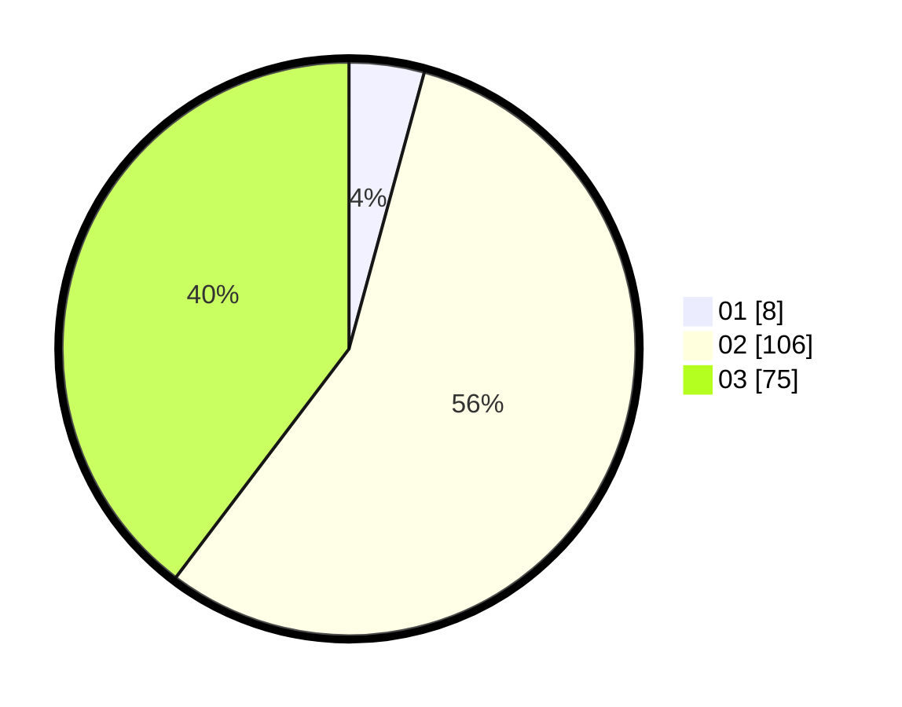

# Hasil

Hasil perolehan suara paslon dapat dilihat pada file paslon-01.txt, paslon-02.txt, dan paslon-03.txt.

Jika tidak ada, artinya data tersebut belum ada pada SIREKAP.

## Perolehan Suara

 * Paslon 01: **8**.
 * Paslon 02: **106**.
 * Paslon 03: **75**.

## Foto C Plano

https://sirekap-obj-formc.kpu.go.id/0319/pemilu/ppwp/31/71/02/10/03/3171021003034-20240216-213407--47bf9f3f-8690-4c66-99c0-10672498ce8c.jpg

https://sirekap-obj-formc.kpu.go.id/0319/pemilu/ppwp/31/71/02/10/03/3171021003034-20240216-213927--b2950a29-a490-4fc6-b7e7-16e038c90a0e.jpg

https://sirekap-obj-formc.kpu.go.id/0319/pemilu/ppwp/31/71/02/10/03/3171021003034-20240216-220639--b59cc96d-984c-4ede-900d-f4f5f58f383a.jpg

## DATA PEMILIH TETAP

Jumlah pemilih dalam DPT: **252**.
 * L: **108**.
 * P: **144**.

## DATA PENGGUNA HAK PILIH

Jumlah pengguna hak pilih dalam DPT: **190**.
 * L: **79**.
 * P: **111**.

Jumlah pengguna hak pilih dalam DPTb: **2**.
 * L: **0**.
 * P: **2**.

Jumlah pengguna hak pilih dalam DPK: **0**.
 * L: **0**.
 * P: **0**.

Jumlah pengguna hak pilih: **192**.
 * L: **79**.
 * P: **113**.

## JUMLAH SUARA SAH DAN TIDAK SAH

JUMLAH SELURUH SUARA SAH: **189**.

JUMLAH SUARA TIDAK SAH: **3**.

JUMLAH SELURUH SUARA SAH DAN SUARA TIDAK SAH: **192**.
