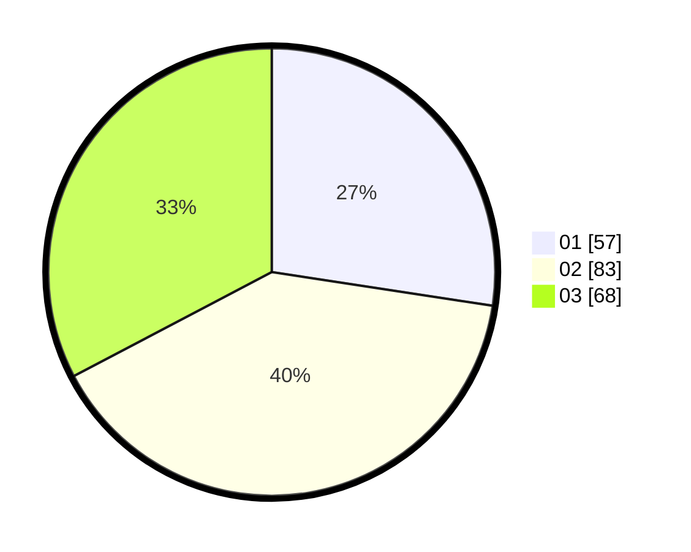

# Hasil

Hasil perolehan suara paslon dapat dilihat pada file paslon-01.txt, paslon-02.txt, dan paslon-03.txt.

Jika tidak ada, artinya data tersebut belum ada pada SIREKAP.

## Perolehan Suara

 * Paslon 01: **57**.
 * Paslon 02: **83**.
 * Paslon 03: **68**.

## Foto C Plano

https://sirekap-obj-formc.kpu.go.id/ead9/pemilu/ppwp/31/71/02/10/03/3171021003035-20240218-195219--dc28ef49-c24e-4535-b417-86a724671b30.jpg

https://sirekap-obj-formc.kpu.go.id/ead9/pemilu/ppwp/31/71/02/10/03/3171021003035-20240218-195636--26fd9df5-e9d8-42e6-8d47-7b7d78b339d7.jpg

https://sirekap-obj-formc.kpu.go.id/ead9/pemilu/ppwp/31/71/02/10/03/3171021003035-20240218-194933--3fbdff72-554d-4b4f-afd8-e6c312c02846.jpg

## DATA PEMILIH TETAP

Jumlah pemilih dalam DPT: **263**.
 * L: **143**.
 * P: **120**.

## DATA PENGGUNA HAK PILIH

Jumlah pengguna hak pilih dalam DPT: **206**.
 * L: **111**.
 * P: **95**.

Jumlah pengguna hak pilih dalam DPTb: **2**.
 * L: **1**.
 * P: **1**.

Jumlah pengguna hak pilih dalam DPK: **2**.
 * L: **2**.
 * P: **0**.

Jumlah pengguna hak pilih: **210**.
 * L: **114**.
 * P: **96**.

## JUMLAH SUARA SAH DAN TIDAK SAH

JUMLAH SELURUH SUARA SAH: **208**.

JUMLAH SUARA TIDAK SAH: **2**.

JUMLAH SELURUH SUARA SAH DAN SUARA TIDAK SAH: **210**.
