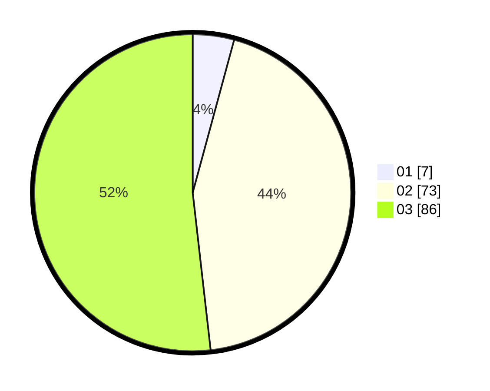

# Hasil

Hasil perolehan suara paslon dapat dilihat pada file paslon-01.txt, paslon-02.txt, dan paslon-03.txt.

Jika tidak ada, artinya data tersebut belum ada pada SIREKAP.

## Perolehan Suara

 * Paslon 01: **7**.
 * Paslon 02: **73**.
 * Paslon 03: **86**.

## Foto C Plano

https://sirekap-obj-formc.kpu.go.id/0c65/pemilu/ppwp/31/71/02/10/03/3171021003037-20240218-121908--c4b872e9-26a8-46d3-a8de-ccf4d9b26775.jpg

https://sirekap-obj-formc.kpu.go.id/0c65/pemilu/ppwp/31/71/02/10/03/3171021003037-20240218-124225--8a5a416e-4653-4785-93a7-57fbcc1b2721.jpg

https://sirekap-obj-formc.kpu.go.id/0c65/pemilu/ppwp/31/71/02/10/03/3171021003037-20240218-124507--aa8478fb-1148-4777-a225-e5d7a73690ba.jpg

## DATA PEMILIH TETAP

Jumlah pemilih dalam DPT: **165**.
 * L: **74**.
 * P: **91**.

## DATA PENGGUNA HAK PILIH

Jumlah pengguna hak pilih dalam DPT: **165**.
 * L: **74**.
 * P: **91**.

Jumlah pengguna hak pilih dalam DPTb: **2**.
 * L: **0**.
 * P: **2**.

Jumlah pengguna hak pilih dalam DPK: **2**.
 * L: **0**.
 * P: **2**.

Jumlah pengguna hak pilih: **169**.
 * L: **74**.
 * P: **95**.

## JUMLAH SUARA SAH DAN TIDAK SAH

JUMLAH SELURUH SUARA SAH: **166**.

JUMLAH SUARA TIDAK SAH: **3**.

JUMLAH SELURUH SUARA SAH DAN SUARA TIDAK SAH: **169**.
