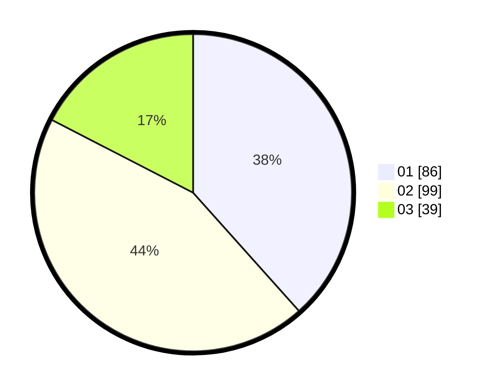

# Hasil

Hasil perolehan suara paslon dapat dilihat pada file paslon-01.txt, paslon-02.txt, dan paslon-03.txt.

Jika tidak ada, artinya data tersebut belum ada pada SIREKAP.

## Perolehan Suara

 * Paslon 01: **86**.
 * Paslon 02: **99**.
 * Paslon 03: **39**.

## Foto C Plano

https://sirekap-obj-formc.kpu.go.id/c654/pemilu/ppwp/31/71/02/10/03/3171021003039-20240217-184351--ba1cb778-651a-49fa-9175-5dacc4ab18da.jpg

https://sirekap-obj-formc.kpu.go.id/c654/pemilu/ppwp/31/71/02/10/03/3171021003039-20240217-184550--5dbd2ca3-1a7a-457d-bcf0-559cfbd24e34.jpg

https://sirekap-obj-formc.kpu.go.id/c654/pemilu/ppwp/31/71/02/10/03/3171021003039-20240217-184954--c7cbf53b-baf4-48bf-aa77-411b397a956f.jpg

## DATA PEMILIH TETAP

Jumlah pemilih dalam DPT: **268**.
 * L: **128**.
 * P: **140**.

## DATA PENGGUNA HAK PILIH

Jumlah pengguna hak pilih dalam DPT: **225**.
 * L: **104**.
 * P: **121**.

Jumlah pengguna hak pilih dalam DPTb: **0**.
 * L: **0**.
 * P: **0**.

Jumlah pengguna hak pilih dalam DPK: **4**.
 * L: **3**.
 * P: **1**.

Jumlah pengguna hak pilih: **229**.
 * L: **107**.
 * P: **122**.

## JUMLAH SUARA SAH DAN TIDAK SAH

JUMLAH SELURUH SUARA SAH: **224**.

JUMLAH SUARA TIDAK SAH: **5**.

JUMLAH SELURUH SUARA SAH DAN SUARA TIDAK SAH: **229**.
