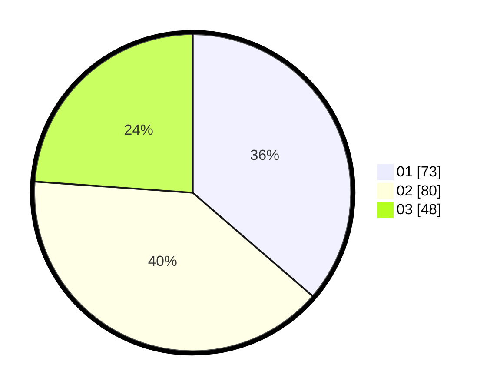

# Hasil

Hasil perolehan suara paslon dapat dilihat pada file paslon-01.txt, paslon-02.txt, dan paslon-03.txt.

Jika tidak ada, artinya data tersebut belum ada pada SIREKAP.

## Perolehan Suara

 * Paslon 01: **73**.
 * Paslon 02: **80**.
 * Paslon 03: **48**.

## Foto C Plano

https://sirekap-obj-formc.kpu.go.id/78dd/pemilu/ppwp/31/71/02/10/03/3171021003040-20240217-202512--5607c91f-b9ad-4375-b3bb-5f90a7fdfd7c.jpg

https://sirekap-obj-formc.kpu.go.id/78dd/pemilu/ppwp/31/71/02/10/03/3171021003040-20240217-200746--a40be178-5cbe-413a-8a16-57a941a6d12a.jpg

https://sirekap-obj-formc.kpu.go.id/78dd/pemilu/ppwp/31/71/02/10/03/3171021003040-20240217-201926--30987666-4aca-42bc-a31a-cce0e8a0700f.jpg

## DATA PEMILIH TETAP

Jumlah pemilih dalam DPT: **251**.
 * L: **119**.
 * P: **132**.

## DATA PENGGUNA HAK PILIH

Jumlah pengguna hak pilih dalam DPT: **196**.
 * L: **94**.
 * P: **102**.

Jumlah pengguna hak pilih dalam DPTb: **7**.
 * L: **0**.
 * P: **7**.

Jumlah pengguna hak pilih dalam DPK: **1**.
 * L: **1**.
 * P: **0**.

Jumlah pengguna hak pilih: **204**.
 * L: **95**.
 * P: **109**.

## JUMLAH SUARA SAH DAN TIDAK SAH

JUMLAH SELURUH SUARA SAH: **201**.

JUMLAH SUARA TIDAK SAH: **3**.

JUMLAH SELURUH SUARA SAH DAN SUARA TIDAK SAH: **204**.
