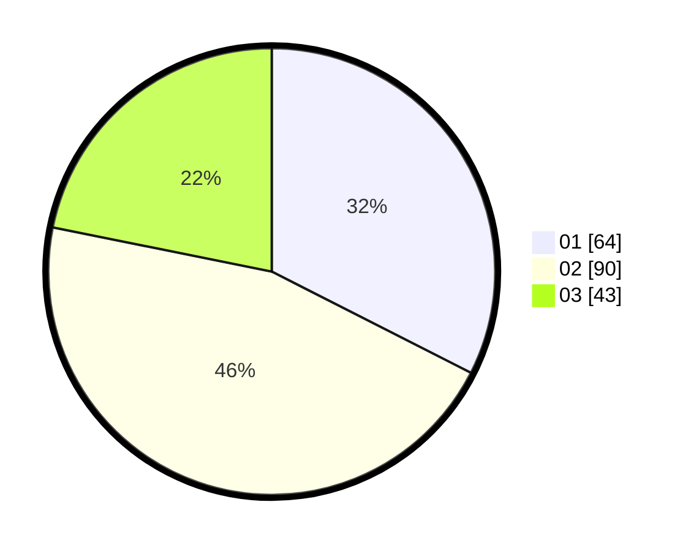

# Hasil

Hasil perolehan suara paslon dapat dilihat pada file paslon-01.txt, paslon-02.txt, dan paslon-03.txt.

Jika tidak ada, artinya data tersebut belum ada pada SIREKAP.

## Perolehan Suara

 * Paslon 01: **64**.
 * Paslon 02: **90**.
 * Paslon 03: **43**.

## Foto C Plano

https://sirekap-obj-formc.kpu.go.id/2d74/pemilu/ppwp/31/71/02/10/03/3171021003041-20240218-151227--80587bd3-dcb4-46af-ab88-06aa4e27cc54.jpg

https://sirekap-obj-formc.kpu.go.id/2d74/pemilu/ppwp/31/71/02/10/03/3171021003041-20240218-152155--e99c2b0a-4237-4f7b-a4cd-635477a37bf6.jpg

https://sirekap-obj-formc.kpu.go.id/2d74/pemilu/ppwp/31/71/02/10/03/3171021003041-20240218-151900--76190840-18a6-4f3d-92e6-b403e8ad42b2.jpg

## DATA PEMILIH TETAP

Jumlah pemilih dalam DPT: **269**.
 * L: **139**.
 * P: **130**.

## DATA PENGGUNA HAK PILIH

Jumlah pengguna hak pilih dalam DPT: **197**.
 * L: **104**.
 * P: **93**.

Jumlah pengguna hak pilih dalam DPTb: **0**.
 * L: **0**.
 * P: **0**.

Jumlah pengguna hak pilih dalam DPK: **4**.
 * L: **3**.
 * P: **1**.

Jumlah pengguna hak pilih: **201**.
 * L: **107**.
 * P: **94**.

## JUMLAH SUARA SAH DAN TIDAK SAH

JUMLAH SELURUH SUARA SAH: **197**.

JUMLAH SUARA TIDAK SAH: **4**.

JUMLAH SELURUH SUARA SAH DAN SUARA TIDAK SAH: **201**.
