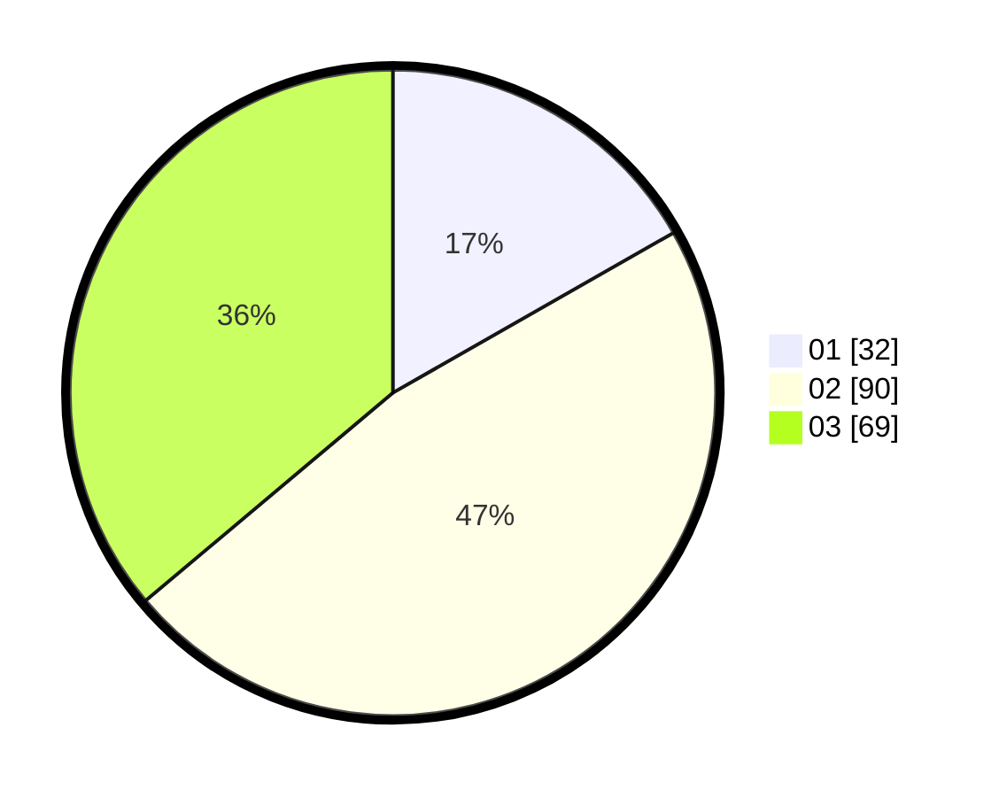

# Hasil

Hasil perolehan suara paslon dapat dilihat pada file paslon-01.txt, paslon-02.txt, dan paslon-03.txt.

Jika tidak ada, artinya data tersebut belum ada pada SIREKAP.

## Perolehan Suara

 * Paslon 01: **32**.
 * Paslon 02: **90**.
 * Paslon 03: **69**.

## Foto C Plano

https://sirekap-obj-formc.kpu.go.id/6e7a/pemilu/ppwp/31/71/02/10/03/3171021003044-20240216-205619--ffe19b82-d3f6-438e-b54c-3d963eab6d25.jpg

https://sirekap-obj-formc.kpu.go.id/6e7a/pemilu/ppwp/31/71/02/10/03/3171021003044-20240216-210851--3dd95a8e-3e63-4250-8435-a47931aca4a6.jpg

https://sirekap-obj-formc.kpu.go.id/6e7a/pemilu/ppwp/31/71/02/10/03/3171021003044-20240216-211759--5785ed6f-a66f-4dc7-be0c-f436aa1b400a.jpg

## DATA PEMILIH TETAP

Jumlah pemilih dalam DPT: **261**.
 * L: **121**.
 * P: **140**.

## DATA PENGGUNA HAK PILIH

Jumlah pengguna hak pilih dalam DPT: **192**.
 * L: **90**.
 * P: **102**.

Jumlah pengguna hak pilih dalam DPTb: **1**.
 * L: **1**.
 * P: **0**.

Jumlah pengguna hak pilih dalam DPK: **2**.
 * L: **2**.
 * P: **0**.

Jumlah pengguna hak pilih: **195**.
 * L: **93**.
 * P: **102**.

## JUMLAH SUARA SAH DAN TIDAK SAH

JUMLAH SELURUH SUARA SAH: **191**.

JUMLAH SUARA TIDAK SAH: **4**.

JUMLAH SELURUH SUARA SAH DAN SUARA TIDAK SAH: **195**.
