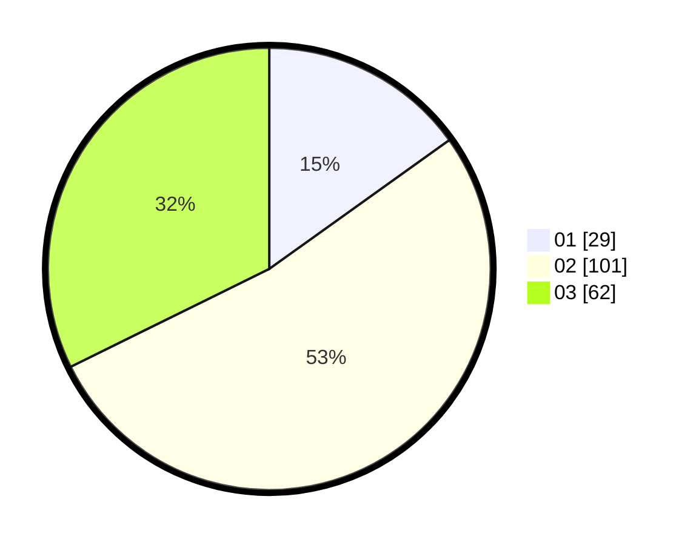

# Hasil

Hasil perolehan suara paslon dapat dilihat pada file paslon-01.txt, paslon-02.txt, dan paslon-03.txt.

Jika tidak ada, artinya data tersebut belum ada pada SIREKAP.

## Perolehan Suara

 * Paslon 01: **29**.
 * Paslon 02: **101**.
 * Paslon 03: **62**.

## Foto C Plano

https://sirekap-obj-formc.kpu.go.id/0b1c/pemilu/ppwp/31/71/02/10/03/3171021003045-20240217-133904--c67cdd71-c9c0-4482-8a4f-79bdd406a10b.jpg

https://sirekap-obj-formc.kpu.go.id/0b1c/pemilu/ppwp/31/71/02/10/03/3171021003045-20240217-143921--97352063-43ea-43e5-af53-325cbe07a61c.jpg

https://sirekap-obj-formc.kpu.go.id/0b1c/pemilu/ppwp/31/71/02/10/03/3171021003045-20240217-142247--1d5d37dc-8d7f-4254-b6ad-79d45b01b374.jpg

## DATA PEMILIH TETAP

Jumlah pemilih dalam DPT: **267**.
 * L: **127**.
 * P: **140**.

## DATA PENGGUNA HAK PILIH

Jumlah pengguna hak pilih dalam DPT: **192**.
 * L: **93**.
 * P: **99**.

Jumlah pengguna hak pilih dalam DPTb: **0**.
 * L: **0**.
 * P: **0**.

Jumlah pengguna hak pilih dalam DPK: **3**.
 * L: **1**.
 * P: **2**.

Jumlah pengguna hak pilih: **195**.
 * L: **94**.
 * P: **101**.

## JUMLAH SUARA SAH DAN TIDAK SAH

JUMLAH SELURUH SUARA SAH: **192**.

JUMLAH SUARA TIDAK SAH: **3**.

JUMLAH SELURUH SUARA SAH DAN SUARA TIDAK SAH: **195**.
