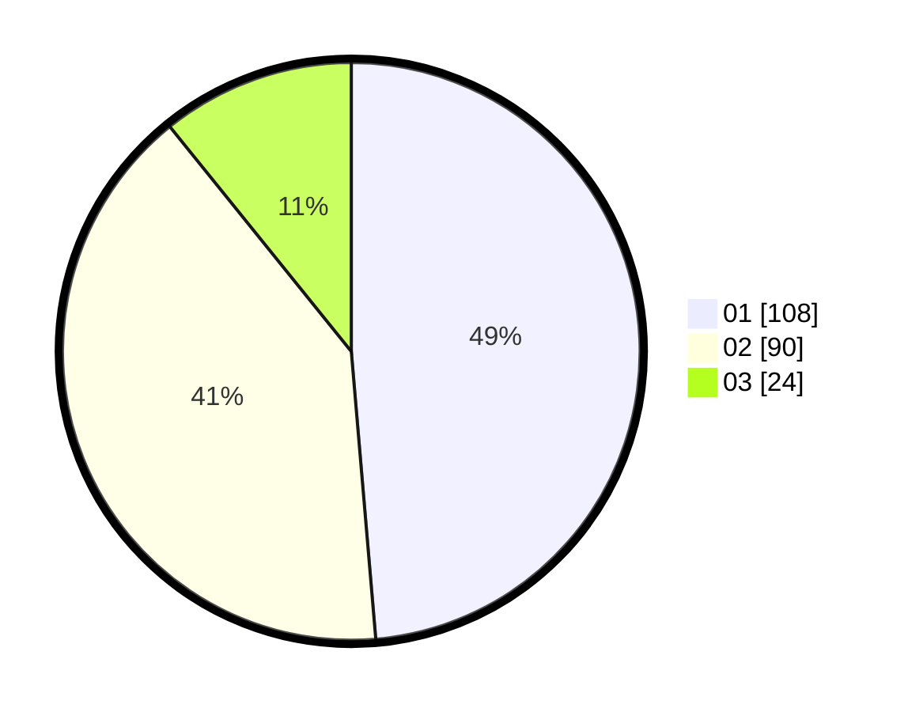

# Hasil

Hasil perolehan suara paslon dapat dilihat pada file paslon-01.txt, paslon-02.txt, dan paslon-03.txt.

Jika tidak ada, artinya data tersebut belum ada pada SIREKAP.

## Perolehan Suara

 * Paslon 01: **108**.
 * Paslon 02: **90**.
 * Paslon 03: **24**.

## Foto C Plano

https://sirekap-obj-formc.kpu.go.id/341c/pemilu/ppwp/31/71/02/10/03/3171021003048-20240214-191411--437cacaa-74fa-4f6f-89c6-33d7d4e3d88d.jpg

https://sirekap-obj-formc.kpu.go.id/341c/pemilu/ppwp/31/71/02/10/03/3171021003048-20240215-023340--ee1b1dfb-0267-43c6-a92a-8b4ea63025a7.jpg

https://sirekap-obj-formc.kpu.go.id/341c/pemilu/ppwp/31/71/02/10/03/3171021003048-20240215-023329--157a468f-a03f-44fc-b77c-1f913f05e9db.jpg

## DATA PEMILIH TETAP

Jumlah pemilih dalam DPT: **266**.
 * L: **133**.
 * P: **133**.

## DATA PENGGUNA HAK PILIH

Jumlah pengguna hak pilih dalam DPT: **221**.
 * L: **109**.
 * P: **112**.

Jumlah pengguna hak pilih dalam DPTb: **0**.
 * L: **0**.
 * P: **0**.

Jumlah pengguna hak pilih dalam DPK: **3**.
 * L: **1**.
 * P: **2**.

Jumlah pengguna hak pilih: **224**.
 * L: **110**.
 * P: **114**.

## JUMLAH SUARA SAH DAN TIDAK SAH

JUMLAH SELURUH SUARA SAH: **222**.

JUMLAH SUARA TIDAK SAH: **2**.

JUMLAH SELURUH SUARA SAH DAN SUARA TIDAK SAH: **224**.
