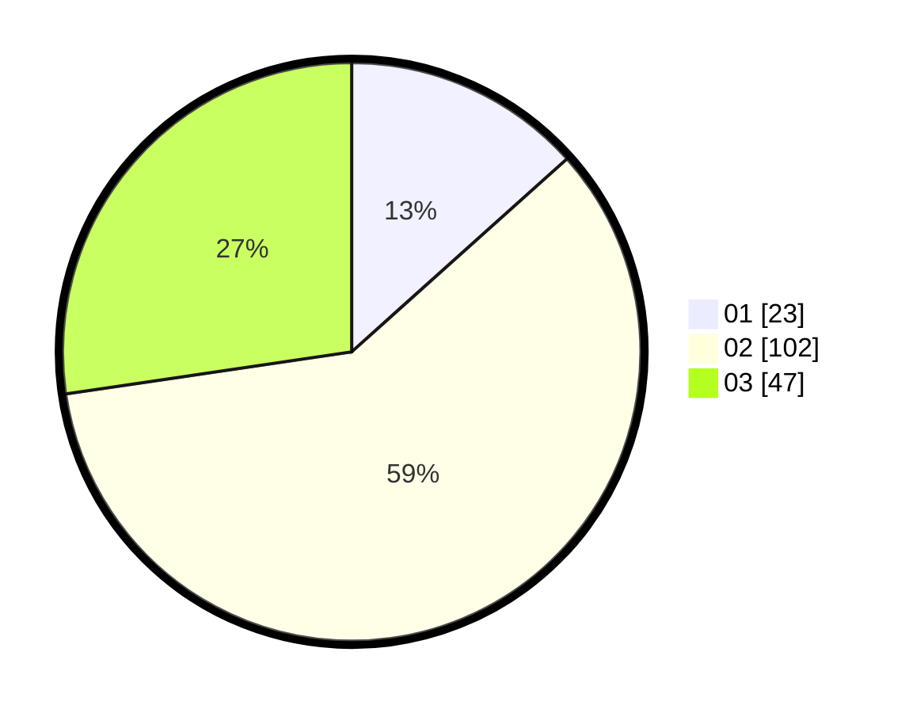

# Hasil

Hasil perolehan suara paslon dapat dilihat pada file paslon-01.txt, paslon-02.txt, dan paslon-03.txt.

Jika tidak ada, artinya data tersebut belum ada pada SIREKAP.

## Perolehan Suara

 * Paslon 01: **23**.
 * Paslon 02: **102**.
 * Paslon 03: **47**.

## Foto C Plano

https://sirekap-obj-formc.kpu.go.id/2e1f/pemilu/ppwp/31/71/02/10/03/3171021003052-20240218-192324--fb4ff660-82b5-4b96-afcb-01c61f7a46dd.jpg

https://sirekap-obj-formc.kpu.go.id/2e1f/pemilu/ppwp/31/71/02/10/03/3171021003052-20240218-193720--17c81662-a928-4561-91d6-6f242ba1a565.jpg

https://sirekap-obj-formc.kpu.go.id/2e1f/pemilu/ppwp/31/71/02/10/03/3171021003052-20240218-195336--7779939d-e1c8-4197-92ce-3b181c4a3edd.jpg

## DATA PEMILIH TETAP

Jumlah pemilih dalam DPT: **248**.
 * L: **124**.
 * P: **124**.

## DATA PENGGUNA HAK PILIH

Jumlah pengguna hak pilih dalam DPT: **172**.
 * L: **85**.
 * P: **87**.

Jumlah pengguna hak pilih dalam DPTb: **3**.
 * L: **3**.
 * P: **0**.

Jumlah pengguna hak pilih dalam DPK: **0**.
 * L: **0**.
 * P: **0**.

Jumlah pengguna hak pilih: **175**.
 * L: **88**.
 * P: **87**.

## JUMLAH SUARA SAH DAN TIDAK SAH

JUMLAH SELURUH SUARA SAH: **172**.

JUMLAH SUARA TIDAK SAH: **3**.

JUMLAH SELURUH SUARA SAH DAN SUARA TIDAK SAH: **175**.
