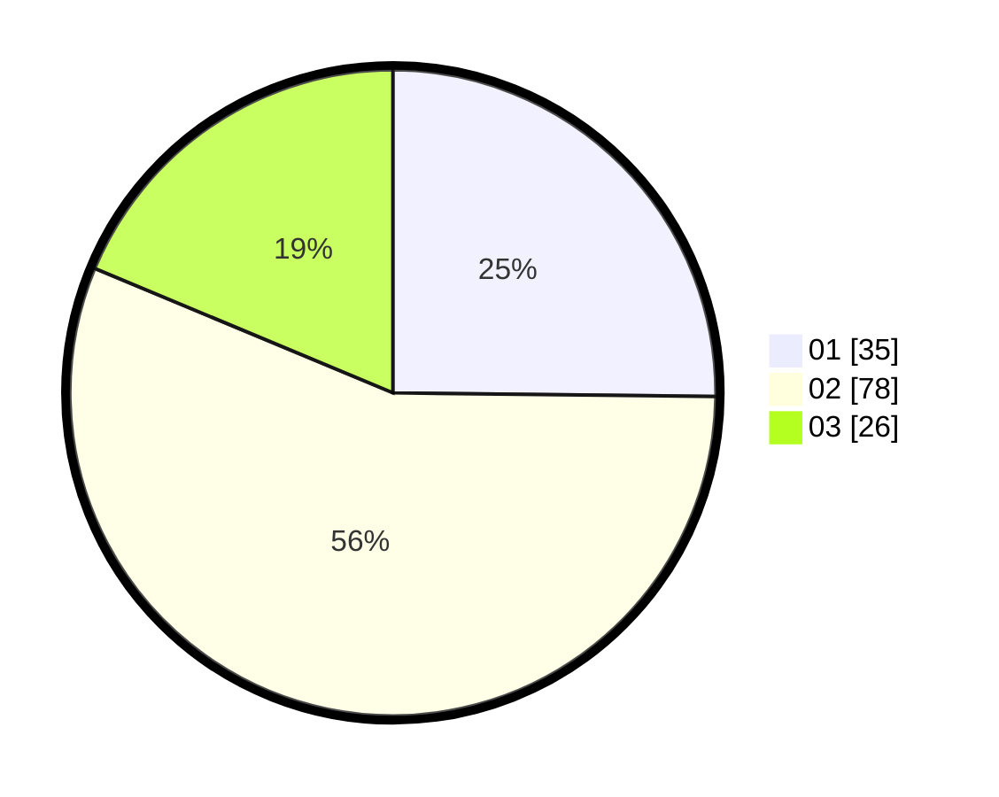

# Hasil

Hasil perolehan suara paslon dapat dilihat pada file paslon-01.txt, paslon-02.txt, dan paslon-03.txt.

Jika tidak ada, artinya data tersebut belum ada pada SIREKAP.

## Perolehan Suara

 * Paslon 01: **35**.
 * Paslon 02: **78**.
 * Paslon 03: **26**.

## Foto C Plano

https://sirekap-obj-formc.kpu.go.id/cfc9/pemilu/ppwp/31/71/02/10/03/3171021003055-20240218-130804--290a04a3-96b4-4da3-b1ac-cfadd216987d.jpg

https://sirekap-obj-formc.kpu.go.id/cfc9/pemilu/ppwp/31/71/02/10/03/3171021003055-20240218-130541--af9a022c-33be-42f6-8821-7aef8bb95971.jpg

https://sirekap-obj-formc.kpu.go.id/cfc9/pemilu/ppwp/31/71/02/10/03/3171021003055-20240218-130714--1df9933f-e8ff-4b0b-817f-6621ac38f0bb.jpg

## DATA PEMILIH TETAP

Jumlah pemilih dalam DPT: **202**.
 * L: **97**.
 * P: **105**.

## DATA PENGGUNA HAK PILIH

Jumlah pengguna hak pilih dalam DPT: **140**.
 * L: **68**.
 * P: **72**.

Jumlah pengguna hak pilih dalam DPTb: **0**.
 * L: **0**.
 * P: **0**.

Jumlah pengguna hak pilih dalam DPK: **1**.
 * L: **0**.
 * P: **1**.

Jumlah pengguna hak pilih: **141**.
 * L: **68**.
 * P: **73**.

## JUMLAH SUARA SAH DAN TIDAK SAH

JUMLAH SELURUH SUARA SAH: **139**.

JUMLAH SUARA TIDAK SAH: **2**.

JUMLAH SELURUH SUARA SAH DAN SUARA TIDAK SAH: **141**.
