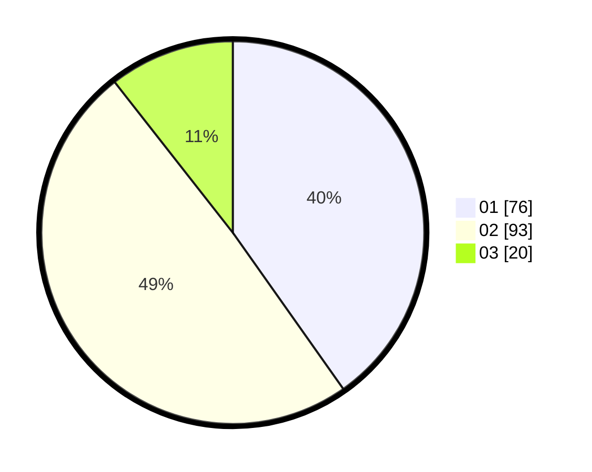

# Hasil

Hasil perolehan suara paslon dapat dilihat pada file paslon-01.txt, paslon-02.txt, dan paslon-03.txt.

Jika tidak ada, artinya data tersebut belum ada pada SIREKAP.

## Perolehan Suara

 * Paslon 01: **76**.
 * Paslon 02: **93**.
 * Paslon 03: **20**.

## Foto C Plano

https://sirekap-obj-formc.kpu.go.id/9a76/pemilu/ppwp/31/71/02/10/03/3171021003057-20240214-204305--4464413d-4b8d-4c86-968c-69409d7efc50.jpg

https://sirekap-obj-formc.kpu.go.id/9a76/pemilu/ppwp/31/71/02/10/03/3171021003057-20240215-013030--f1fc9156-2449-41f2-9649-ebae14f4e88b.jpg

https://sirekap-obj-formc.kpu.go.id/9a76/pemilu/ppwp/31/71/02/10/03/3171021003057-20240215-013820--bb54d5e8-f991-48c2-bb19-fb2485bd307f.jpg

## DATA PEMILIH TETAP

Jumlah pemilih dalam DPT: **252**.
 * L: **128**.
 * P: **124**.

## DATA PENGGUNA HAK PILIH

Jumlah pengguna hak pilih dalam DPT: **193**.
 * L: **95**.
 * P: **98**.

Jumlah pengguna hak pilih dalam DPTb: **0**.
 * L: **0**.
 * P: **0**.

Jumlah pengguna hak pilih dalam DPK: **1**.
 * L: **0**.
 * P: **1**.

Jumlah pengguna hak pilih: **194**.
 * L: **0**.
 * P: **0**.

## JUMLAH SUARA SAH DAN TIDAK SAH

JUMLAH SELURUH SUARA SAH: **189**.

JUMLAH SUARA TIDAK SAH: **5**.

JUMLAH SELURUH SUARA SAH DAN SUARA TIDAK SAH: **194**.
