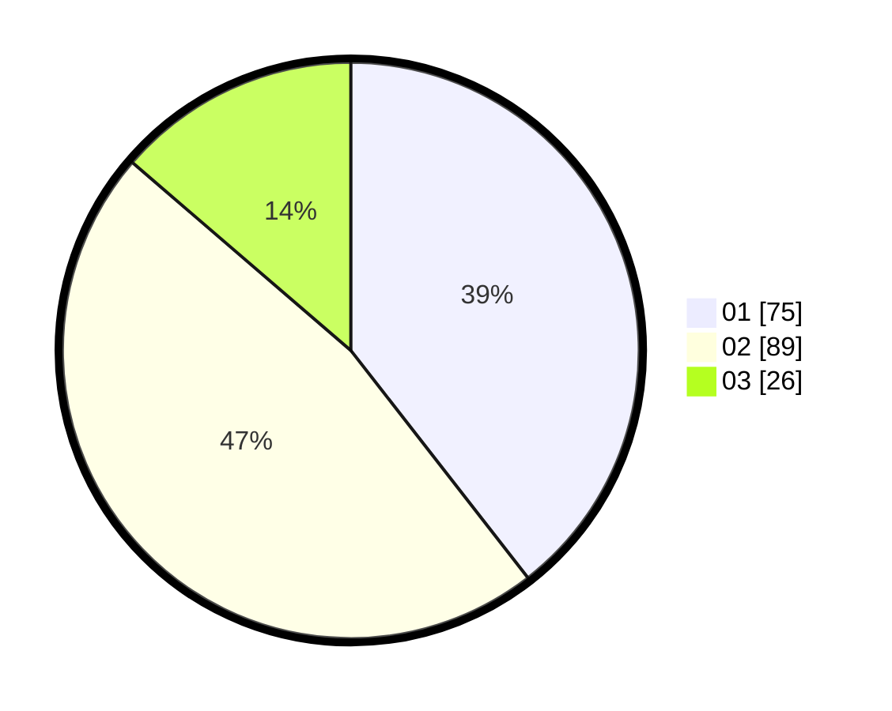

# Hasil

Hasil perolehan suara paslon dapat dilihat pada file paslon-01.txt, paslon-02.txt, dan paslon-03.txt.

Jika tidak ada, artinya data tersebut belum ada pada SIREKAP.

## Perolehan Suara

 * Paslon 01: **75**.
 * Paslon 02: **89**.
 * Paslon 03: **26**.

## Foto C Plano

https://sirekap-obj-formc.kpu.go.id/849b/pemilu/ppwp/31/71/02/10/03/3171021003058-20240215-012649--3020f11a-da0c-435c-b7d8-768a5f0c09b1.jpg

https://sirekap-obj-formc.kpu.go.id/849b/pemilu/ppwp/31/71/02/10/03/3171021003058-20240215-012725--590c9092-e0bb-4522-9c0b-19afa1ff48a4.jpg

https://sirekap-obj-formc.kpu.go.id/849b/pemilu/ppwp/31/71/02/10/03/3171021003058-20240215-012834--5a5f73d7-2c0d-4486-bd21-2807fec9e028.jpg

## DATA PEMILIH TETAP

Jumlah pemilih dalam DPT: **264**.
 * L: **137**.
 * P: **233**.

## DATA PENGGUNA HAK PILIH

Jumlah pengguna hak pilih dalam DPT: **180**.
 * L: **88**.
 * P: **100**.

Jumlah pengguna hak pilih dalam DPTb: **2**.
 * L: **7**.
 * P: **1**.

Jumlah pengguna hak pilih dalam DPK: **3**.
 * L: **2**.
 * P: **1**.

Jumlah pengguna hak pilih: **143**.
 * L: **91**.
 * P: **702**.

## JUMLAH SUARA SAH DAN TIDAK SAH

JUMLAH SELURUH SUARA SAH: **190**.

JUMLAH SUARA TIDAK SAH: **3**.

JUMLAH SELURUH SUARA SAH DAN SUARA TIDAK SAH: **193**.
