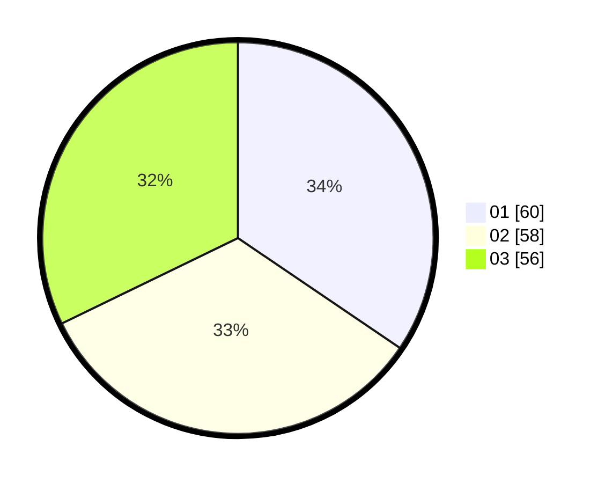

# Hasil

Hasil perolehan suara paslon dapat dilihat pada file paslon-01.txt, paslon-02.txt, dan paslon-03.txt.

Jika tidak ada, artinya data tersebut belum ada pada SIREKAP.

## Perolehan Suara

 * Paslon 01: **60**.
 * Paslon 02: **58**.
 * Paslon 03: **56**.

## Foto C Plano

https://sirekap-obj-formc.kpu.go.id/3b68/pemilu/ppwp/31/71/02/10/03/3171021003059-20240214-155357--31a4d4f7-725d-468f-a5ad-0a244467c54c.jpg

https://sirekap-obj-formc.kpu.go.id/3b68/pemilu/ppwp/31/71/02/10/03/3171021003059-20240214-155100--c24567a6-94c4-48d3-96ef-c35e66b0c814.jpg

https://sirekap-obj-formc.kpu.go.id/3b68/pemilu/ppwp/31/71/02/10/03/3171021003059-20240214-191640--d1b75b04-ba5a-411b-b299-2e71c0fa60d6.jpg

## DATA PEMILIH TETAP

Jumlah pemilih dalam DPT: **247**.
 * L: **114**.
 * P: **133**.

## DATA PENGGUNA HAK PILIH

Jumlah pengguna hak pilih dalam DPT: **183**.
 * L: **77**.
 * P: **106**.

Jumlah pengguna hak pilih dalam DPTb: **0**.
 * L: **0**.
 * P: **0**.

Jumlah pengguna hak pilih dalam DPK: **0**.
 * L: **0**.
 * P: **0**.

Jumlah pengguna hak pilih: **183**.
 * L: **77**.
 * P: **106**.

## JUMLAH SUARA SAH DAN TIDAK SAH

JUMLAH SELURUH SUARA SAH: **174**.

JUMLAH SUARA TIDAK SAH: **9**.

JUMLAH SELURUH SUARA SAH DAN SUARA TIDAK SAH: **183**.
