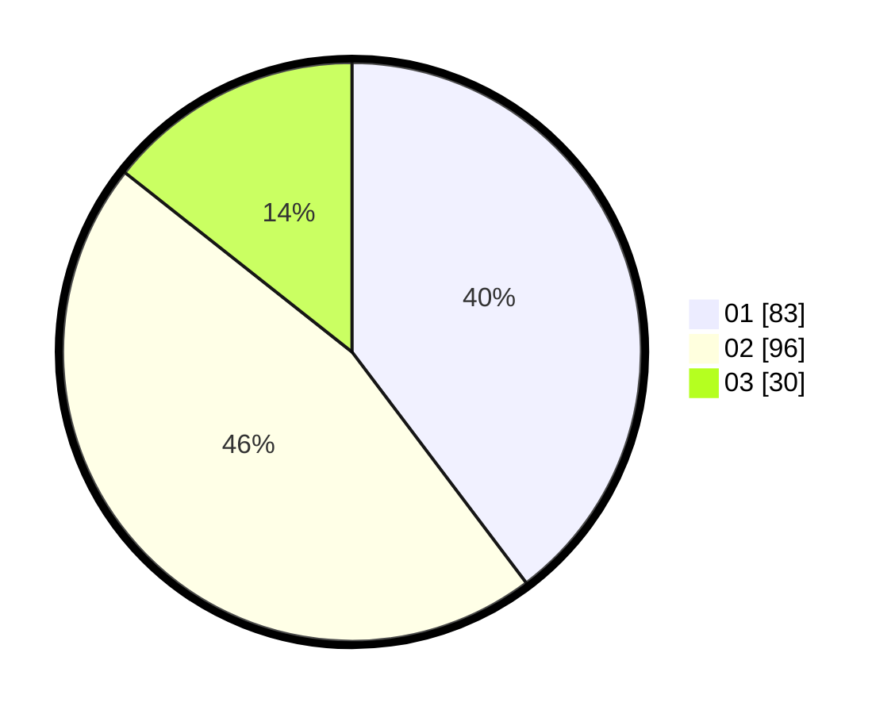

# Hasil

Hasil perolehan suara paslon dapat dilihat pada file paslon-01.txt, paslon-02.txt, dan paslon-03.txt.

Jika tidak ada, artinya data tersebut belum ada pada SIREKAP.

## Perolehan Suara

 * Paslon 01: **83**.
 * Paslon 02: **96**.
 * Paslon 03: **30**.

## Foto C Plano

https://sirekap-obj-formc.kpu.go.id/f1d3/pemilu/ppwp/31/71/02/10/03/3171021003061-20240215-194642--cf32b402-2a8b-4225-8eac-2b965008b85d.jpg

https://sirekap-obj-formc.kpu.go.id/f1d3/pemilu/ppwp/31/71/02/10/03/3171021003061-20240215-194711--3af1da93-145c-4077-b513-f14121b79002.jpg

https://sirekap-obj-formc.kpu.go.id/f1d3/pemilu/ppwp/31/71/02/10/03/3171021003061-20240215-194700--c63e8f4f-7d8e-4244-b3ea-5299f8a0490b.jpg

## DATA PEMILIH TETAP

Jumlah pemilih dalam DPT: **286**.
 * L: **151**.
 * P: **135**.

## DATA PENGGUNA HAK PILIH

Jumlah pengguna hak pilih dalam DPT: **205**.
 * L: **104**.
 * P: **101**.

Jumlah pengguna hak pilih dalam DPTb: **2**.
 * L: **1**.
 * P: **1**.

Jumlah pengguna hak pilih dalam DPK: **2**.
 * L: **1**.
 * P: **1**.

Jumlah pengguna hak pilih: **209**.
 * L: **106**.
 * P: **103**.

## JUMLAH SUARA SAH DAN TIDAK SAH

JUMLAH SELURUH SUARA SAH: **209**.

JUMLAH SUARA TIDAK SAH: **0**.

JUMLAH SELURUH SUARA SAH DAN SUARA TIDAK SAH: **209**.
