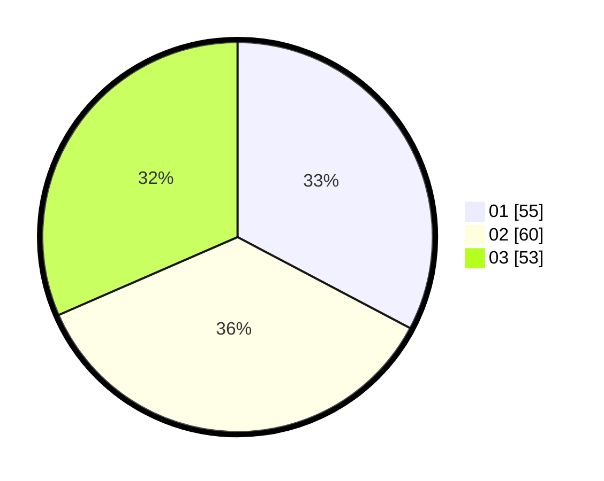

# Hasil

Hasil perolehan suara paslon dapat dilihat pada file paslon-01.txt, paslon-02.txt, dan paslon-03.txt.

Jika tidak ada, artinya data tersebut belum ada pada SIREKAP.

## Perolehan Suara

 * Paslon 01: **55**.
 * Paslon 02: **60**.
 * Paslon 03: **53**.

## Foto C Plano

https://sirekap-obj-formc.kpu.go.id/27ee/pemilu/ppwp/31/71/02/10/03/3171021003062-20240218-154457--3e6ec606-5729-4649-b179-ad84882361d2.jpg

https://sirekap-obj-formc.kpu.go.id/27ee/pemilu/ppwp/31/71/02/10/03/3171021003062-20240218-154632--a0b2a6a5-d57a-4c64-ad1a-21780f5b510b.jpg

https://sirekap-obj-formc.kpu.go.id/27ee/pemilu/ppwp/31/71/02/10/03/3171021003062-20240218-154750--72b60503-f87d-4de4-8dfa-224fbdebad9e.jpg

## DATA PEMILIH TETAP

Jumlah pemilih dalam DPT: **254**.
 * L: **134**.
 * P: **120**.

## DATA PENGGUNA HAK PILIH

Jumlah pengguna hak pilih dalam DPT: **166**.
 * L: **89**.
 * P: **77**.

Jumlah pengguna hak pilih dalam DPTb: **2**.
 * L: **0**.
 * P: **2**.

Jumlah pengguna hak pilih dalam DPK: **1**.
 * L: **0**.
 * P: **1**.

Jumlah pengguna hak pilih: **169**.
 * L: **89**.
 * P: **80**.

## JUMLAH SUARA SAH DAN TIDAK SAH

JUMLAH SELURUH SUARA SAH: **168**.

JUMLAH SUARA TIDAK SAH: **1**.

JUMLAH SELURUH SUARA SAH DAN SUARA TIDAK SAH: **169**.
