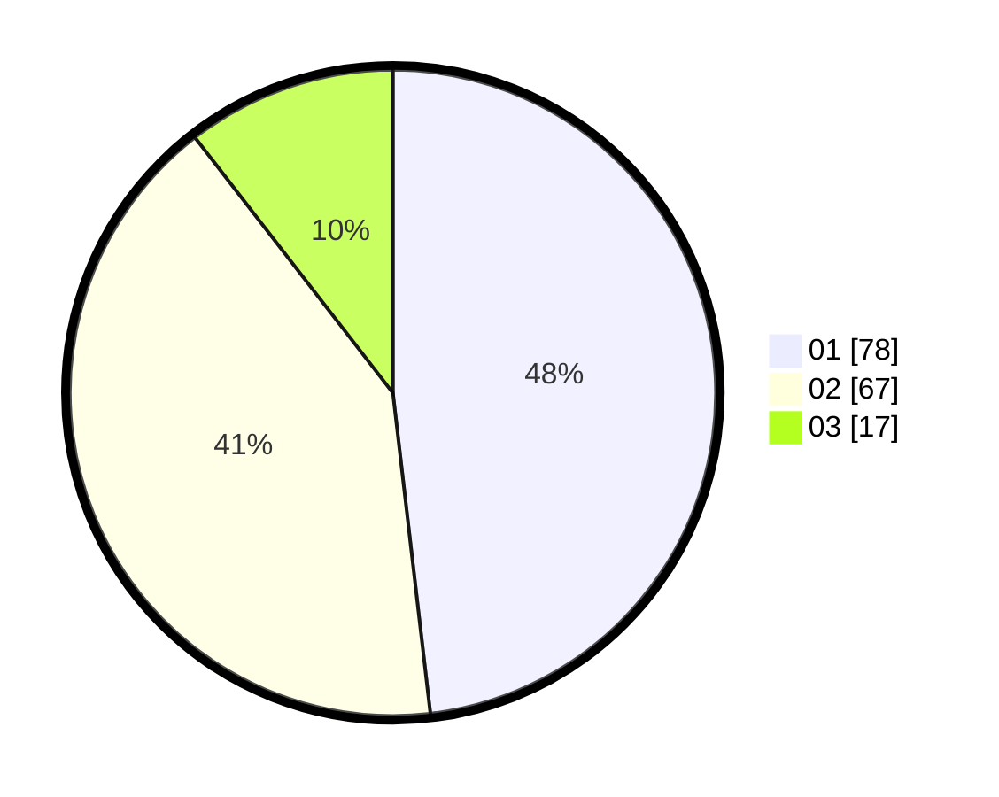

# Hasil

Hasil perolehan suara paslon dapat dilihat pada file paslon-01.txt, paslon-02.txt, dan paslon-03.txt.

Jika tidak ada, artinya data tersebut belum ada pada SIREKAP.

## Perolehan Suara

 * Paslon 01: **78**.
 * Paslon 02: **67**.
 * Paslon 03: **17**.

## Foto C Plano

https://sirekap-obj-formc.kpu.go.id/8693/pemilu/ppwp/31/71/02/10/03/3171021003067-20240217-120558--3b9c00c0-9dce-4b0d-97e5-14fda858424a.jpg

https://sirekap-obj-formc.kpu.go.id/8693/pemilu/ppwp/31/71/02/10/03/3171021003067-20240217-121126--108c4ef6-e601-401e-b232-8fe7926f4675.jpg

https://sirekap-obj-formc.kpu.go.id/8693/pemilu/ppwp/31/71/02/10/03/3171021003067-20240217-121410--2bb16f37-b843-447d-ac7c-3fa84b939ff6.jpg

## DATA PEMILIH TETAP

Jumlah pemilih dalam DPT: **245**.
 * L: **127**.
 * P: **118**.

## DATA PENGGUNA HAK PILIH

Jumlah pengguna hak pilih dalam DPT: **163**.
 * L: **78**.
 * P: **85**.

Jumlah pengguna hak pilih dalam DPTb: **1**.
 * L: **0**.
 * P: **1**.

Jumlah pengguna hak pilih dalam DPK: **0**.
 * L: **0**.
 * P: **0**.

Jumlah pengguna hak pilih: **164**.
 * L: **78**.
 * P: **86**.

## JUMLAH SUARA SAH DAN TIDAK SAH

JUMLAH SELURUH SUARA SAH: **162**.

JUMLAH SUARA TIDAK SAH: **2**.

JUMLAH SELURUH SUARA SAH DAN SUARA TIDAK SAH: **164**.
