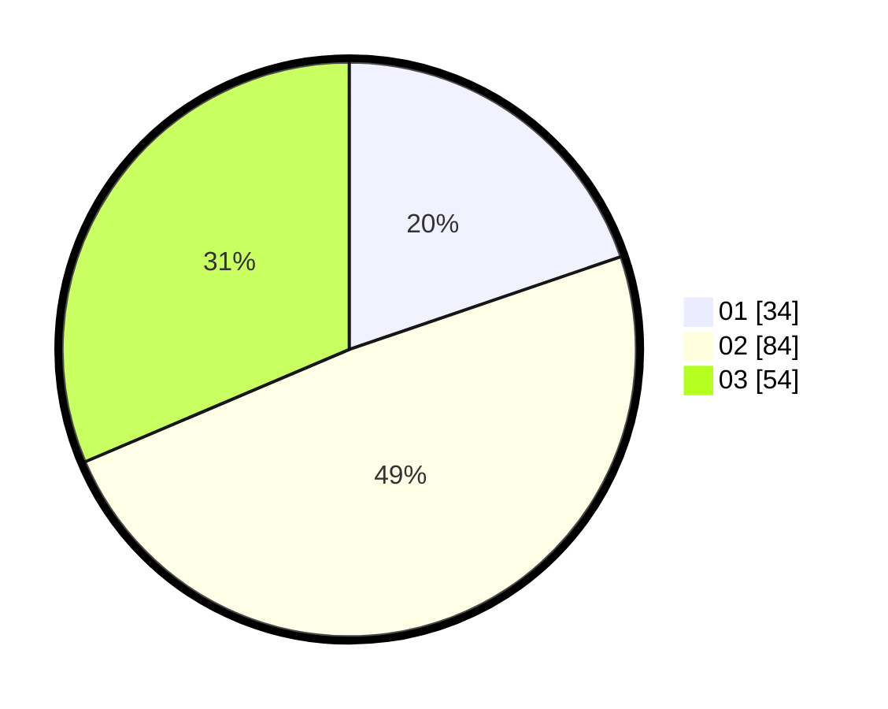

# Hasil

Hasil perolehan suara paslon dapat dilihat pada file paslon-01.txt, paslon-02.txt, dan paslon-03.txt.

Jika tidak ada, artinya data tersebut belum ada pada SIREKAP.

## Perolehan Suara

 * Paslon 01: **34**.
 * Paslon 02: **84**.
 * Paslon 03: **54**.

## Foto C Plano

https://sirekap-obj-formc.kpu.go.id/db85/pemilu/ppwp/31/71/02/10/03/3171021003069-20240219-152532--4f4038ab-40e4-4fc8-b7ae-f3d46782aef7.jpg

https://sirekap-obj-formc.kpu.go.id/db85/pemilu/ppwp/31/71/02/10/03/3171021003069-20240218-141923--2c3149fa-c989-426e-9422-4bb76261e12f.jpg

https://sirekap-obj-formc.kpu.go.id/db85/pemilu/ppwp/31/71/02/10/03/3171021003069-20240218-143647--85e4ea4c-962a-44b6-bd38-01f5fc9fd8e9.jpg
