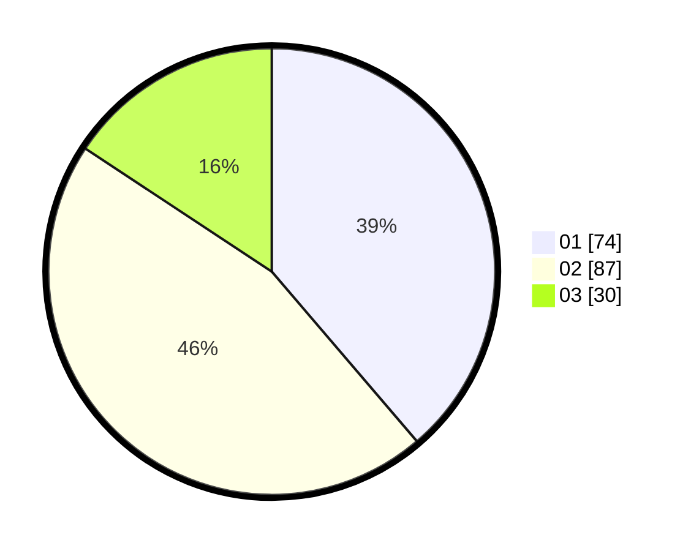

# Hasil

Hasil perolehan suara paslon dapat dilihat pada file paslon-01.txt, paslon-02.txt, dan paslon-03.txt.

Jika tidak ada, artinya data tersebut belum ada pada SIREKAP.

## Perolehan Suara

 * Paslon 01: **74**.
 * Paslon 02: **87**.
 * Paslon 03: **30**.

## Foto C Plano

https://sirekap-obj-formc.kpu.go.id/20cf/pemilu/ppwp/31/71/02/10/03/3171021003075-20240214-155054--cade9144-08f4-45db-b1ba-af262a5849f9.jpg

https://sirekap-obj-formc.kpu.go.id/20cf/pemilu/ppwp/31/71/02/10/03/3171021003075-20240214-155112--ada35fab-3ff3-4dd1-acbe-ca37c226aefe.jpg

https://sirekap-obj-formc.kpu.go.id/20cf/pemilu/ppwp/31/71/02/10/03/3171021003075-20240214-155127--1d3d558f-2a9c-4e49-a30a-75909407ab29.jpg

## DATA PEMILIH TETAP

Jumlah pemilih dalam DPT: **270**.
 * L: **141**.
 * P: **129**.

## DATA PENGGUNA HAK PILIH

Jumlah pengguna hak pilih dalam DPT: **191**.
 * L: **95**.
 * P: **96**.

Jumlah pengguna hak pilih dalam DPTb: **0**.
 * L: **0**.
 * P: **0**.

Jumlah pengguna hak pilih dalam DPK: **0**.
 * L: **0**.
 * P: **0**.

Jumlah pengguna hak pilih: **191**.
 * L: **95**.
 * P: **96**.

## JUMLAH SUARA SAH DAN TIDAK SAH

JUMLAH SELURUH SUARA SAH: **191**.

JUMLAH SUARA TIDAK SAH: **0**.

JUMLAH SELURUH SUARA SAH DAN SUARA TIDAK SAH: **191**.
